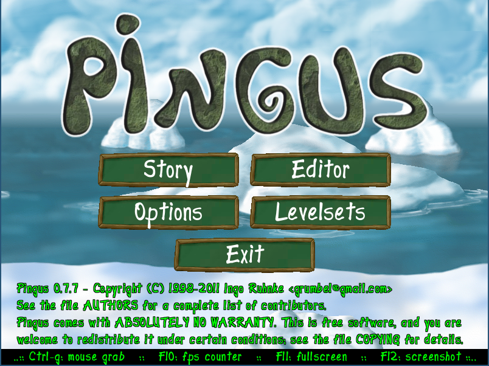
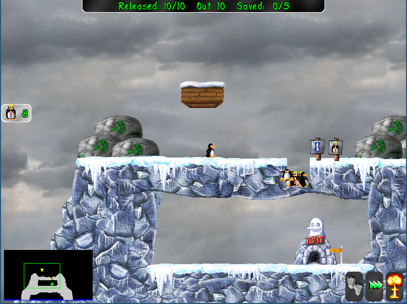

<head>
    <title>On Rewriting Pingus from C++ to Céu</title>
    <meta http-equiv="Content-Type" content="text/html; charset=UTF-8"/>
    <style>
        body {
            width:950px;
            margin:0 auto;
            text-align: justify;
            text-justify: inter-word;
        }
        pre {
            padding: 10px 10px 10px 10px;
            background-color: #E5E4E2;
        }
        code {
            background-color: #E5E4E2;
        }
        div.images {
            float: right;
            background-color: #ffffff;
            border: 1px solid black;
            padding: 10px;
            margin: 0 0 5px 10px;
/*
            width: 120px;
*/
            text-align: center;
        }
        div.box {
            float: right;
            background-color: #ffffff;
            border: 1px solid black;
            padding: 10px;
            margin: 0 0 5px 10px;
            display: inline-block;
            width: 400px;
        }
        div.summary {
            background-color: #FFCCCC;
            border: 1px solid black;
            padding: 5px;
        }
    </style>

@[[
FIG_COUNT = 0

function FIG_NEW (file, title, width)
    assert(file and _G[file] == nil, 'repeated Figure: "'..tostring(file)..'"')
    width = (width and ('width="'..width..'"')) or ''
    FIG_COUNT = FIG_COUNT + 1
    _G[file] = FIG_COUNT
    return [=[
<div class="images">

<br>
<a href="images/]=]..file..[=[">
Figure ]=]..FIG_COUNT..[=[</a>: ]=]..title..[=[
</div>
]=]
end

function FIG_REF (file)
    return 'Figure '..assert(_G[file], 'figure not found: '..file)
end

CODE2N = nil

local KEYS = {
    CPP = {
        'class', 'else', 'return', 'if', 'while', 'case',
        'bool', 'this', 'false', 'true', 'void', 'int',
        'new', 'switch', 'typedef', 'for', 'break', 'float',
    },
    CEU = {
        'class', 'else', 'return', 'if',
        'bool', 'this', 'false', 'true', 'void', 'int',
        'do', 'end', 'loop', 'escape', 'then', 'global', 'with', 'watching',
        'await', 'emit',
        'par', 'par/or', 'par/and', 'call',
        'var', 'event', 'in', 'or',
        'and', 'interface', 'until', 'pool',
        'every', 'spawn', 'break', 'not',
    },
}

function CODE_LINES (code)
    local sep = lpeg.P('\n')
    local elem = lpeg.C((1 - sep)^0)
    local p = lpeg.Ct(elem * (sep * elem)^0)
    local t = lpeg.match(p, code)

    local OPTS = {}
    for opt,v in string.gmatch(t[1], '(%a+)=(%a+),?') do
        OPTS[opt] = v
    end

    assert(t[#t] == '')
    table.remove(t, 1)
    table.remove(t, #t)

    if OPTS.reset ~= 'false' then
        CODE2N = {}
    end

    for i, line in ipairs(t) do
        local id = string.match(line, '@(.*)$')
        if id then
            assert(not CODE2N[id], 'repeated @id: "'..id..'"')
            CODE2N[id] = i
            line = string.gsub(line, ' +@.*$', '')
            t[i] = line
        end
        if OPTS.lines ~= 'false' then
            t[i] = string.format('<b><font size="-1" color="#666666">%2s',i)..
                                 ':</font></b>  '..line
        end
    end
    local ret = table.concat(t,'\n')

    if OPTS.language then
        for _, key in ipairs(assert(KEYS[OPTS.language])) do
            ret = string.gsub(ret, '([%s%p]+)('..key..')([%s%p])', '%1<b>%2</b>%3')
            ret = string.gsub(ret, '([%s%p]+)('..key..')$',    '%1<b>%2</b>')
            --ret = string.gsub(ret, '([%s%p]+)('..key..'%p+)',  '%1<b>%2</b>')
        end
    end

    return '<pre><code>'..ret..'</code></pre>'
end

function N (id)
    return assert(CODE2N[id], 'not found: @'..id)
end

function NN (id1, sep, id2)
    sep = (sep=='' and ',') or sep
    if sep then
        return '(ln. '..N(id1)..sep..N(id2)..')'
    else
        return '(ln. '..N(id1)..')'
    end
end


SECS = {}

function SEC (str)
    local ln, hs, tit = string.match(str, '(\n*)(#*) (.*)')
    local n = string.len(hs) - 1
    if n > #SECS then
        SECS[#SECS+1] = 0
    elseif n == #SECS then
    else
        while n < #SECS do
            SECS[#SECS] = nil
        end
    end
    SECS[#SECS] = SECS[#SECS] + 1
    return ln..hs..' '..table.concat(SECS,'.')..') '..tit
end

]]

</head>
<body>

<!--
silentcast, transparent window interior, dont go under the default size
convert credits-anim.gif -fuzz 10% -layers Optimize optimised.gif
convert -delay 200 -loop 0 *.png state-anim.gif
:%s/\(\[X]\[[^]]*\]\)/\&#91;\1\&#93;/g
chico@note:/opt/pingus/ceu$ lua md-macros.lua README.md > /tmp/README.md
chico@note:/opt/pingus/ceu$ pandoc /tmp/README.md >README.html 
key-mon --noshift --noalt

TODO:
    - TARGET AUDIENCE
        - game developers that have faced these problems before

TODO:
    - ver os patterns do GPP
        - nao cubro algum que ocorre no pingus?
        - cubro algum com nome diferente?
        - cubro algum que o GPP nao cobre?
    - hierarchy
        - exemplo de z-order lexico em vez de dinamico

TODO:
    - only control flow advances
        - no type inference
        - no GC
        - no functional compositions
        - no data abstraction
        - no rearrange of overall arch

- GOALS: stress-test the language
    - robustness
        - silly bugs (untested stuff)
    - programability
        - everyday stuff
            - maths, vectors
    - performance
        - FPS, RAM, ROM
    - false positives (too much?)
        - tight loops
    - C tricks: {}, _XXX, etc

- TODO: threads, lua

- compare to actors
    - parallel, synchronous-run-to-completion
    - not a loop+queue
-->

[X]: images/link_12.png

# On Rewriting Pingus from C++ to Céu

* [What](#what-is-this-all-about),
  [Why](#why-rewrite-pingus-to-céu),
  [How](#how-to-rewrite),
  [Who](#who)?
* Analysis: [Qualitative](#qualitative-analysis),
            [Quantitative](#quantitative-analysis)

<!--
* [TLDR!](#tldr!)
    - did you do a complete port?
    - why is this cool?
    - ok, but with which gains in productivity?
    - what about CPU,ROM,RAM?
-->

## What is this all about?

This report documents the process of rewriting the video game Pingus
[[![X]][pingus-1],[![X]][pingus-2]]
from C++ to the programming language Céu
[[![X]][ceu-1],[![X]][ceu-2]].





[pingus-1]: http://pingus.seul.org/
[pingus-2]: https://github.com/Pingus/pingus/
[ceu-1]: http://ceu-lang.org/
[ceu-2]: https://github.com/fsantanna/ceu/

<a name="warming-up"/>

### Warming Up!

Let's consider the case of handling double clicks in the game.

@FIG_NEW(double-click-opt.gif,
         Double click detection,
         350)

In Pingus, double clicking the *Armageddon button* literally explodes all 
pingus (@FIG_REF[[double-click-opt.gif]]).

<!-- CPP-ARMAGEDDON -->

The code in C++ implements the class `ArmageddonButton` 
[[![X]][cpp-armageddon]] with methods for rendering the button and handling its 
events.
Here, we focus on detecting the double click, hiding unrelated parts with 
`<...>`:

@CODE_LINES[[language=CPP,
ArmageddonButton::ArmageddonButton(<...>):
    RectComponent(<...>),                       @base_class
    <...>
    pressed(false); // initial button state             @pressed_1
    press_time();   // how long since the 1st click?    @press_time_1
    <...>
{
    <...>
}

void ArmageddonButton::draw (<...>) {           @draw_1
    <...>
}                                               @draw_2

void ArmageddonButton::update (float delta) {   @update_1
    <...>
    if (pressed) {                              @pressed_4
        press_time += delta;                    @press_time_2
        if (press_time > 1.0f) {
            pressed = false;    // giving up, 1st click was     @reset_1
            press_time = 0;     //            too long ago      @reset_2
        }
    } else {
        <...>
        press_time = 0;
    }
}                                               @update_2

void ArmageddonButton::on_click (<...>) {       @on_click_1
    if (pressed) {                              @pressed_3
        server->send_armageddon_event();        @armageddon
    } else {
        pressed = true;                         @pressed_2
    }
}                                               @on_click_2
]]

The `update` @NN(update_1,-,update_2) and `on_click` 
@NN(on_click_1,-,on_click_2)
are the relevant methods of the class and are examples of *short-lived 
callbacks*, which are pieces of code that execute in reaction to external input 
events.
The callback `on_click` reacts to mouse clicks detected by the base class 
`RectComponent` @NN(base_class), while `update` continuously reacts to the 
passage of time.
Callbacks must be short lived because they should react to input as fast as 
possible to keep the game with real-time responsiveness.

@FIG_NEW(double-click.png,
         State machine for the *Armageddon* double click,
         550)

The class first initializes the variable `pressed` to track the first click 
@NN(pressed_1,,pressed_2).
It also initializes the variable `press_time` to count the time since the first 
click @NN(press_time_1,,press_time_2).
If another click occurs within 1 second, the class signals the double click to 
the application @NN(armageddon).
Otherwise, the `pressed` and `press_time` state variables are reset 
@NN(reset_1,-,reset_2).

@FIG_REF[[double-click.png]] illustrates how we can model the double-click 
behavior as a state machine.
The circles represent the state of the variables in the class, while the arrows 
represent callback reactions that manipulate the state.

Note how the accesses to these state variables are spread across the entire 
class.
For instance, the distance between the initialization of `pressed` 
@NN(pressed_1) and the last access to it @NN(pressed_2) is over 40 lines in the 
original file [[![X]][cpp-armageddon-2]].
Arguably, this dispersion of code across methods makes the understanding and 
maintenance of the double-click behavior more difficult.
Also, even though the state variables are private, unrelated methods such as 
`draw` @NN(draw_1,-,draw_2) can potentially access it.

Because callbacks are short lived, the only way they can affect each other is 
by manipulating persisting member variables in the object.
These *state variables* retain their values across multiple invocations and 
serve as a control mechanism across reaction to external events.
As an example, callbacks `on_click` and `update` react independently but must 
agree on a common protocol to detect the double click:

* Callback `on_click` writes to `pressed` in the first click @NN(pressed_3), 
  and checks its state in further clicks @NN(pressed_2).
* In the meantime, callback `update` also checks for `pressed` and may reset 
  its state @NN(pressed_4,,reset_1).

<!-- CEU-ARMAGEDDON -->

Using an antagonistic approach, Céu provides structured constructs to deal with 
events, aiming to eradicate explicit manipulation of state variables for 
control-flow purposes.
The equivalent code in Céu defines the class `ArmageddonButton` 
[[![X]][ceu-armageddon]] as follows:

@CODE_LINES[[language=CEU,
class ArmageddonButton with
    <...>
do                                       @do
    var RectComponent component = <...>;
    <...>
    loop do                              @loop_do
        await component.on_click;        @await_1
        watching 1s do                   @watching_do
            await component.on_click;    @await_2
            break;                       @break
        end                              @watching_end
    end                                  @loop_end
    <...>
    emit global:go_armageddon;           @emit
end                                      @end
]]

Instead of *objects*, classes in Céu instantiate *organisms* with a body 
declaration @NN(do,-,end) that starts to execute automatically.
Unlike objects, an organism is a reactive entity that executes concurrently 
with other organisms.
Organisms react to external events sequentially, one after the other, resulting 
in deterministic programs.
Unlike callbacks, organism bodies keep the execution context across event 
occurrences alive (if they don't terminate).

The double click detection is a `loop` @NN(loop_do,-,loop_end) that awaits the 
first click @NN(await_1) and then, watching 1 second 
@NN(watching_do,-,watching_end), awaits the second click @NN(await_2).
If the second click occurs within 1 second, we `break` the loop @NN(break) and 
signal the double click to the application @NN(emit).
Otherwise, the `watching` block as a whole aborts and restarts the loop, 
falling back to the first click `await` @NN(await_1).

Note how double click detection in Céu doesn't require state variables and is 
entirely self-contained in the `loop` body  @NN(loop_do,-,loop_end).
Furthermore, these 7 lines of code **only** detects a double click, leaving the 
actual effect to happen outside the loop @NN(emit).

As we argue throughout this document, appropriate control-flow mechanisms for 
reactive applications (e.g., `await` and `watching`) helps on the structure and 
composition of code, resulting in considerable gains in productivity.

[cpp-armageddon]: https://github.com/Pingus/pingus/blob/v0.7.6/src/pingus/components/action_button.cpp#L24 
[cpp-armageddon-2]: https://github.com/Pingus/pingus/blob/v0.7.6/src/pingus/components/action_button.cpp#L33-#L90
[ceu-armageddon]: https://github.com/fsantanna/pingus/blob/ceu/ceu/pingus/components/action_button.ceu#L6

## Why rewriting Pingus to Céu?

The main motivation to rewrite Pingus from C++ to Céu is to promote its 
programming model in the context of video games.
Céu supports concurrent and deterministic abstractions to specify entities with 
a high degree of real-time interactions such as in video games.

@FIG_NEW(sweeney.png,
         Three "kinds" of code,
         350)

According to Tim Sweeney (of Unreal Engine fame), about half of the development 
complexity in games resides in *simulation* [[![X]][sweeney]], i.e., in the way 
entities interact in real time.
If we consider that *numeric computation* and *shading* do not vary from game 
to game (i.e., they are part of a game engine), the tendency is to shift the 
complexity even more towards game simulation.
Furthermore, only 10% of the CPU budget goes to game simulation, opening an 
opportunity for gains in productivity.

[sweeney]: https://www.cs.princeton.edu/~dpw/popl/06/Tim-POPL.ppt

<!--
When updating 10,000 objects at 60 FPS, everything is performance-sensitive
But:
Productivity is just as important
Will gladly sacrifice 10% of our performance
for 10% higher productivity
We never use assembly language

Gameplay Simulation
Gratuitous use of mutable state
10,000’s of objects must be updated
Typical object update touches 5-10 other objects

This is the hardest problem…
10,00’s of objects
Each one contains mutable state
Each one updated 30 times per second
Each update touches 5-10 other objects
 
Manual synchronization (shared state concurrency) is 
hopelessly intractible here.
 
Solutions?
Rewrite as referentially-transparent functions?
Message-passing concurrency?
Continue using the sequential, single-threaded approach?

Update all objects concurrently in arbitrary order, with each update wrapped in 
an atomic {...} block.
With 10,000’s of updates, and 5-10 objects touched per update, collisions will 
be low.
~2-4X STM performance overhead is acceptable:
if it enables our state-intensive code to scale to many threads, it’s still a win

Claim: Transactions are the only plausible solution to concurrent mutable state
-->

Besides promoting the concurrency model of Céu, we have additional motivations 
to write this report as follows:

* Expose Céu to a real code base that was neither specified nor implemented by 
  the designers of the language.
  Even though video games match the domain of Céu, a real-world project 
  consists of a range of requirements, forcing us to transpose the "academic
  fences" of papers (which usually only explore idiomatic code).
* Exercise the interface between Céu and C/C++.
  Céu is designed to integrate seamlessly with C.
  This allowed us to perform a *live rewriting*, i.e., we incrementally rewrote 
  code from C++ to Céu without breaking the game for long.
* Serve as a deep and comprehensive guide for developers interested in trying 
  Céu.
  We provide an in-depth comparison between the original code in C++ and the 
  equivalent code rewritten to Céu for a number of behaviors in the game.
* Stress-test the implementation of Céu.
  Academic artifacts typically do not go beyond working prototypes.
  We also want Céu to be a robust and practical language for everyday use.
* Evaluate the performance of Céu.
  Having C++ as a benchmark, how does Céu compare in terms of memory usage, 
  code size, and execution time (e.g., FPS rate)?

## How to rewrite from C++ to Céu?

The general idea is to identify control-flow behavior in the game that crosses 
successive reactions to events.
Our hypothesis is that the implementation in C++ involves callbacks 
manipulating state explicitly.
We then rewrite these behaviors in a class in Céu, using appropriate structured 
constructs, and redirect the instantiation and event dispatching to the new 
class.
The remaining classes in C++ should interoperate with the new classes in Céu 
until we complete the rewriting process.

Note that we only touch classes that deal with events, as Céu is actually less 
expressive than C++ for pure data manipulation.
Therefore, we also rely on the tight integration between Céu and C/C++ to take 
advantage of the existing code base and libraries.

To identify these control-flow behaviors, we inspect the C++ class definitions 
searching for members with suspicious names (e.g.,
[`pressed`][state-pressed],
[`particle_thrown`][state-particle-thrown],
[`mode`][state-mode], or
[`delay_count`][state-delay-count]).
Good chances are that variables with identifiers resembling verbs, status, or 
counters encode some form of control-flow progression that cross multiple 
callback invocations.

[state-pressed]: https://github.com/Pingus/pingus/blob/v0.7.6/src/pingus/components/action_button.hpp#L36
[state-particle-thrown]: https://github.com/Pingus/pingus/blob/v0.7.6/src/pingus/actions/bomber.hpp#L31
[state-mode]: https://github.com/Pingus/pingus/blob/v0.7.6/src/pingus/actions/bridger.hpp#L30
[state-delay-count]: https://github.com/Pingus/pingus/blob/v0.7.6/src/pingus/actions/digger.hpp#L32

During the course of the rewriting process, and following the class-by-class 
identification described above, we could extract more abstract control patterns 
that should apply to other games.
Our hypothesis is that other games manifesting such patterns must use some form 
of explicit state which are likely subject to the same rewriting process.

Overall, we believe that most difficulties in implementing control behavior in 
games is not inherent to this domain, but result of accidental complexity due 
to the lack of structured abstractions and appropriate concurrency models to 
handle event-based applications.

### Control-Flow Patterns in Pingus

We identified eight control-flow patterns in Pingus which we discuss further 
along with in-depth examples:

<a name="finite-state-machines"/>

1. [**Finite State Machines**](#finite-state-machines):
    State machines describe the behavior of game entities by mapping event 
    occurrences to transitions between states and triggering appropriate
    actions.
    * [ [case 1](#finite-state-machines-1) |
      [ [case 2](#finite-state-machines-2) |
      [summary](#finite-state-machines-summary) ]

2. [**Continuation Passing**](#continuation-passing):
    The completion of a long-lasting activity in a game may have a 
    continuation, i.e., some action to execute next.
    * [ [case 1](#continuation-passing-1) |
      [ [case 2](#continuation-passing-2) |
      [summary](#continuation-passing-summary) ]


3. [**Dispatching Hierarchies**](#dispatching-hierarchies):
    Some entities manage other child entities, resulting in dispatching 
    hierarchies for event forwarding.
    * [ [case 1](#dispatching-hierarchies-1) |
      [summary](#dispatching-hierarchies-summary) ]

4. [**Scoping Hierarchies**](#scoping-hierarchies):
    Some entities manage other child entities, resulting in scoping hierarchies 
    for the lifespan of objects.
    * [ [case 1](#scoping-hierarchies-1) |
      [ [case 2](#scoping-hierarchies-2) |
      [summary](#scoping-hierarchies-summary) ]

5. [**Signaling Mechanisms**](#signaling-mechanism):
    Entities often need to communicate explicitly through a signaling 
    mechanism, especially if there is no hierarchy relationship between them.
    * [ [case 1](#signaling-mechanism-1) |
      [summary](#signaling-mechanism-summary) ]

<!--
6. [**Wall-Clock Timers**](#wall-clock-timers):
    Wall-clock timers measure the passage of time from the real world
    (e.g., *10 seconds*) such as for periodic sampling and timeout watchdogs.
    * [ [summary](#wall-clock-timers-summary) ]
-->

6. [**Pausing**](#pausing):
    Pausing allows parts of the game to temporarily stop reacting to incoming
    events.
    * [ [summary](#pausing-summary) ]

7. [**Resource Acquisition and Release**](#resource-acquisition-and-release):
    External resources, such as configuration files and saved games,
    must be acquired and properly released.
    * [ [summary](#resource-acquisition-and-release-summary) ]

<!-- TODO: are these terms and explanations symmetric? -->

## Who?

Francisco Sant'Anna

* <http://www.ceu-lang.org/chico/>
* <https://github.com/fsantanna/>
* [&#64;fsantanna_uerj](https://twitter.com/fsantanna_uerj/)

### Acknowledgments

Leonardo Kaplan

* <https://github.com/leokaplan/>

Alexander Tkachov

* <https://github.com/Tkachov/>

-------------------------------------------------------------------------------

# Qualitative Analysis

- why not quantitative?
    - focus on how
    - not all changes delete code
    - more intereseted in changes that remove global rearrange
        - expressiveness

TODO: Selected Code Snippets
TODO: state vars, code reduction para cada case

<a name="finite-state-machines"/>

@SEC[[
## Finite State Machines
]]

State machines describe the behavior of game entities by mapping event 
occurrences to transitions between states and triggering appropriate actions.
<!--
The double click behavior for the *Armageddon button* is an example of a simple 
state machine.
TODO: Case 3: Sprite Animations
-->

<a name="finite-state-machines-1"/>

@SEC[[
### Case Study: The *Armageddon* Double Click
]]

See [Warming Up](#warming-up).

<a name="finite-state-machines-2"/>

@SEC[[
### Case Study: The *Bomber* Action
]]

@FIG_NEW(bomber-opt.gif,
         The *Bomber* action,
         350)

The *Bomber* action explodes the clicked pingu, throwing particles around and 
also destroying the terrain under its radius (@FIG_REF[[bomber-opt.gif]]).

@FIG_NEW(state-anim/state-anim.gif,
         State machine for the *Bomber* animation,
         550)

A sequential state machine (@FIG_REF[[state-anim/state-anim.gif]]) models the 
animation with actions associated to specific frames as follows:

1. 0th frame:  plays a "Oh no!" sound.
2. 10th frame: plays a "Bomb!" sound.
3. 13th frame: throws particles, destroys the terrain, and shows an explosion
               sprite.
4. Game tick:  hides the explosion sprite.
5. Last frame: kills the pingu.

*(Open [this video][youtube-bomber] to listen to the sound effects.)*

[youtube-bomber]: https://youtu.be/QLXIT59il6o?t=306

The code in C++ defines the class `Bomber` [[![X]][cpp-bomber]] with callbacks 
`draw` and `update` to manage the state machine:

@CODE_LINES[[language=CPP,
Bomber::Bomber (Pingu* p) :
    <...>
    sprite(),                   // bomber sprite
    sound_played(false),        // tracks state 2               @def_1
    particle_thrown(false),     // tracks state 3
    colmap_exploded(false),     // tracks state 3
    gfx_exploded(false)         // tracks state 4               @def_2
{
    <...>
    // 1. 0th frame: plays a "Oh no!" sound.
    get_world()->play_sound("ohno", pingu->get_pos());          @sound_ohno
}

void Bomber::update ()
{
    sprite.update ();                                           @update_1
    <...>   // pingu movement                                   @update_2

    // 2. 10th frame: plays a "Bomb!" sound.
    if (sprite.get_current_frame()==10 && !sound_played) {      @sound_bomb_1
        sound_played = true;
        get_world()->play_sound("plop", pingu->get_pos());
    }                                                           @sound_bomb_2

    // 3. 13th frame: throws particles, destroys the terrain, shows an explosion sprite
    if (sprite.get_current_frame()==13 && !particle_thrown) {   @state_3_1
        particle_thrown = true;
        get_world()->get_pingu_particle_holder()->add_particle(pingu->get_x(),
                                                               pingu->get_y()-5);
    }
    if (sprite.get_current_frame()==13 && !colmap_exploded) {
        colmap_exploded = true;
        get_world()->remove(bomber_radius, <...>);
    }                                                           @state_3_2

    // 5. Last frame: kills the Pingu
    if (sprite.is_finished ()) {                                @die_1
        pingu->set_status(Pingu::PS_DEAD);
    }                                                           @die_2
}

void Bomber::draw (SceneContext& gc) {
    // 3. 13th frame: throws particles, destroys the terrain, shows an explosion sprite
    // 4. Game tick: hides the explosion sprite
    if (sprite.get_current_frame()==13 && !gfx_exploded) {      @state_3_3
        gfx_exploded = true;                                    @state_3_4
        gc.color().draw (explo_surf, <...>);                    @state_4
    }
    gc.color().draw(sprite, pingu->get_pos());
}
]]

<!--*-->

The class defines one state variable for each action to perform 
@NN(def_1,-,def_2).
The "Oh no!" sound plays as soon as the object starts in *state-1* 
@NN(sound_ohno).
The `update` callback updates pingu animation and movement every frame 
regardless of its current state @NN(update_1,-,update_2).
When the animation reaches the 10th frame, it plays the "Bomb!" sound and 
switches to *state-2* @NN(sound_bomb_1,-,sound_bomb_2).
The state variable `sound_played` is required because the sprite frame doesn't 
necessarily advance on every `update` invocation.
The same reasoning and technique applies to the *state-3*
(ln. @N(state_3_1)-@N(state_3_2) and @N(state_3_3)-@N(state_3_4)).
The explosion sprite appears in a single frame in *state-4* @NN(state_4).
Finally, the pingu dies after the animation frames terminate 
@NN(die_1,-,die_2).

Note that a single numeric state variable would suffice to track the states.
Probably, the authors chose to encode each state in an independent boolean 
variable to rearrange and experiment with them during the development.
Still, due to the short-lived nature of callbacks, state variables are 
unavoidable, and are actually the essence of object-oriented programming
(i.e., *methods + mutable state*).

<a name="bomber"/>

The implementation in Céu doesn't require explicit state variables and reflects 
the sequential state machine implicitly, as sequential code separated by 
`await` statements:

@CODE_LINES[[language=CEU,
class Bomber with
    <...>
do
    <...>
    var Sprite sprite = <...>;      // bomber sprite
    par do                                                          @par_do
        <...>   // pingu movement                                   @move
    with
        // 1. 0th frame: plays a "Oh no!" sound.                    @anim_1
        call global:play_sound("ohno", 0.5, 0.0);

        // 2. 10th frame: plays a "Bomb!" sound.
        await WORLD_UPDATE until sprite.get_current_frame() == 10;
        call global:play_sound("plop", 0.5, 0.0);

        // 3. 13th frame: throws particles, destroys the terrain, shows an explosion sprite
        await WORLD_UPDATE until sprite.get_current_frame() == 13;
        emit global:go_create_pingu_particles => (this.pingu.get_x(),
                                                  this.pingu.get_y()-5);
        global:remove(&&_bomber_radius, <...>);
        do                                                          @do
            var Sprite _ = Sprite.build_name(<...>, &&explo);
            // 4. Game tick: hides the explosion sprite
            await WORLD_UPDATE;
        end                                                         @end

        // 5. Last frame: kills the pingu
        await sprite;                                               @await
        escape {ActionName::DEAD};                                  @anim_2
    end                                                             @par_end
end
]]

The `par` composition @NN(par_do,-,par_end) isolates non-interacting behaviors, 
such as the pingu movement @NN(move) and animation @NN(anim_1,-,anim_2).
The animation is a direct sequence of statements that await transition 
conditions to change behavior.

Note that we use a local and lexically-scoped organism
(to be discussed further [[![X]](#dispatching-hierarchies)])
for the temporary single-frame explosion @NN(do,-,end).
We also use auxiliary signaling mechanisms
(to be discussed further [[![X]](#signaling-mechanisms)])
to await the termination of the animation @NN(await) and
to notify the application about our own termination.

<a name="finite-state-machines-summary"/>
<br/>

<div class="summary">
**Summary**:

Implicit state machines in Céu provide some advantages in comparison to 
explicit state machines in C++:

* They encode all states with direct sequential code, not requiring state
  variables.
* They handle all states (and only them) in the same contiguous block,
  improving code encapsulation.
</div>

[cpp-bomber]: https://github.com/Pingus/pingus/blob/v0.7.6/src/pingus/actions/bomber.cpp
[ceu-bomber]: https://github.com/fsantanna/pingus/blob/ceu/ceu/pingus/actions/bomber.ceu

<a name="continuation-passing"/>

@SEC[[
## Continuation Passing
]]

The completion of a long-lasting activity in a game may have a continuation, 
i.e., some action to execute next.

<!--
If the execution flow is dynamic, the program has to tell the activity where to 
go when it completes.
In Pingus, when the player terminates a level, the game may terminate or return 
to the main menu, depending on how it was invoked from the command line.

Continuation passing is a special case of a state machine in which the previous 
state passes to the current state what will be the next state.

- tudo porque eu consigo voltar/retornar das "chamadas"
    - programacao estruturada

more natural structured code with sequences, conditionals, and loops
-->

<a name="continuation-passing-1"/>

@SEC[[
### Case Study: Story Screen, Advancing Pages
]]

@FIG_NEW(story-anim.gif,
         The *Story* screen,
         350)

The world map of Pingus has clickable *blue dots* with ambience stories about 
the game (@FIG_REF[[story-anim.gif]]).
The words for each story page appears incrementally over time.
The first click in the button `>>>` fast forwards the text.
The second click advances to the next page until the story terminates.
If the page displays completely due to the time elapsing, the first click 
advances to the next page.

<!-- CPP-STORY-PAGES -->

The code in C++ [[![X]][cpp-story-screen-component]] defines the class 
`StoryScreenComponent` with a `next_text` method to advance the words and 
pages:

@CODE_LINES[[language=CPP,
StoryScreenComponent::StoryScreenComponent (<...>) :
    <...>
{
    pages        = <...>;                       @pages_1
    current_page = pages.back();                @pages_2
    displayed    = false;                       @dsp_1
    <...>
}

<...>   // draw and update page

void StoryScreenComponent::next_text() {
    if (!displayed) {                           @dsp_2
        displayed = true;                       @dsp_3
        <...>
    } else {                                    @adv_1
        pages.pop_back();                       @pages_3
        if (!pages.empty()) {
            current_page = pages.back();        @pages_4
            displayed    = false;               @dsp_4
            <...>
        } else {
            <...>   // terminates the story screen
        }
    }                                           @adv_2
}
]]

@FIG_NEW(story.png,
         State machine for the *Story* screen,
         550)

The variable `pages` (ln. @N(pages_1)-@N(pages_2), @N(pages_3)-@N(pages_4)) is 
a vector holding each page and also encodes *continuations* for the story 
progress:
each call to `next_text` that advances the story @NN(adv_1,-,adv_2) removes a 
page @NN(pages_3) and sets the next action to perform (display a new page) in 
the variable `current_page` @NN(pages_4).
@FIG_REF[[story.png]] illustrates the state machine for fast-forwarding the 
words inside the dashed rectangle and the continuation mechanism to advance 
pages.
The state variable `displayed` (ln. @N(dsp_1),@N(dsp_2),@N(dsp_3),@N(dsp_4)) 
switches between the behaviors "advancing text" and "advancing pages" which are 
mixed inside the method `next_text`.

<!-- CEU-STORY-PAGES -->

The code in Céu [[![X]][ceu-story-pages]] uses a `next_text` event to advance 
the words and pages:

@CODE_LINES[[language=CEU,
class StoryScreen with
    <...>
do
    event void next_text;

    _pages = <...>

    loop i in _pages.size() do                              @loop_do
        par/or do
            <...>       // loop to redraw current page
        with
            watching next_text do
                <...>   // loop to advance text over time   @advance
            end
            await next_text;                                @await
        end
    end                                                     @loop_end
end
]]

For the sequential navigation from page to page, we use a simple loop 
@NN(loop_do,,loop_end) instead of an explicit continuation state.
While the text advances in an inner loop (hidden in ln. @N(advance)), we watch 
the `next_text` event to fast forward it.
The inner loop may also eventually terminate with the time elapsing.
To go to the next page, we simply `await next_text` again @NN(await).
Note that we don't need a variable (such as `displayed` above) to switch 
between the states "advancing text" or "advancing pages" which are not mixed in 
the source code.

<a name="continuation-passing-2"/>

@SEC[[
### Case Study: Story Screen, Transition to Credits Screen
]]

@FIG_NEW(credits-anim.gif,
         Transition from *Story* to *Credits* screen,
         350)

The world map has clickable story dots for both introductory and ending 
stories.
For introductory stories, the game returns to the world map after displaying 
the pages.
For ending stories, the game also displays a *Credits* screen before returning 
to the world map (@FIG_REF[[credits-anim.gif]]).

<!-- CPP-STORY-CREDITS -->

The `StoryDot` in C++ [[![X]][cpp-story-dot]] reads the level file to check 
whether the story should, after termination, display the *Credits* screen or 
not:

@CODE_LINES[[language=CPP,
StoryDot::StoryDot(const FileReader& reader) :
    m_credits(false),                           // by default, don't display
{
    <...>
    reader.read_bool("credits", m_credits);     // read from the file
}

void StoryDot::on_click() {
    <...>
    ScreenManager::instance()->push_screen(std::make_shared<StoryScreen>(<...>, m_credits)); @call
    <...>
}
]]

The boolean variable `m_credits` is passed to the `StoryScreen` @NN(call)
[[![X]][cpp-story-screen]] and represents its continuation, i.e., what to do 
after displaying the story.
The `StoryScreen` forwards the continuation [[![X]][cpp-story-screen-forward]] 
to the `StoryComponent` [[![X]][cpp-story-screen-component]]:

@CODE_LINES[[language=CPP,
StoryScreenComponent::StoryScreenComponent (<...>) :
    m_credits(credits),
    <...>
{
    <...>
}

<...>   // draw and update page

void StoryScreenComponent::next_text() {
    if (!displayed) {
        <...>
    } else {
        <...>
        if (!pages.empty()) {
            <...>
        } else {                @adv_1
            if (m_credits) {    @m_credits
                ScreenManager::instance()->replace_screen(std::make_shared<Credits>(<...>));
            } else {
                ScreenManager::instance()->pop_screen();
            }
        }                       @adv_2
    }
}
]]

When the method `next_text` has no pages to display @NN(adv_1,-,adv_2), it 
decides where to go next, depending on the continuation flag `m_credits` 
@NN(m_credits).

<!-- CEU-STORY-CREDITS -->

In Céu, the flow between the screens to display is a simple sequence of 
statements:

@CODE_LINES[[language=CEU,
loop do
    var int ret = do WorldmapScreen;                @call_world
    if ret==_WORLDMAP_RETURN_STORY_MAP or ret==_WORLDMAP_RETURN_STORY_CREDITS then
        <...>                                       @story_1
        var bool is_click = do StoryScreen;         @call_story
        if is_click and ret==_WORLDMAP_RETURN_STORY_CREDITS then @check
            do Credits;                             @call_credits
        end                                         @story_2
    else
        <...>
    end
end
]]

<div class="box">
**The `do` notation**:

The `do` notation is a syntactic sugar for creating and awaiting an organism, 
e.g.:

@CODE_LINES[[language=CEU, lines=false, reset=false,
var int ret = do WorldmapScreen;
<...>

// is equivalent to

var int ret;
do
    var WorldmapScreen w;
    ret = await w;
end
<...>
]]

A `do` is analogous to a procedure call, holding the current state while the 
started organism executes.
The code in sequence (marked as `<...>`) only executes after the organism 
terminates.
</div>

We first "call" a `WorldmapScreen` organism @NN(call_world), which exhibits the 
map and let the player interact until it clicks in a dot.
If the player selects a story dot @NN(story_1,-,story_2), we "call" the story 
@NN(call_story) and also await its termination.
Finally, we check the return values @NN(check) to display the `Credits` 
@NN(call_credits).

@FIG_NEW(continuation.png,
         Continuation [C++] vs Direct [Céu] Styles,
         500)

@FIG_REF[[continuation.png]] depicts the *continuation-passing style* of C++ 
and *direct style* of Céu for the screen transitions:

1. `Main Loop` => `Worldmap`:
    C++ uses an explicit stack to push the *World Map* screen;
    Céu calls the *World Map* screen (with the `do` notation), expecting a 
    return
    value;
2. `Worldmap` (*blue dot click*) => `Story`:
    C++ `StoryDot` pushes the *Story* screen forward, also passing the 
    continuation flag;
    Céu gets the return value of the `Worldmap` (i.e., if it should display the 
    `Credits`) and calls the *Story* screen.
3. `Story` => `Credits`:
    C++ `Story` replaces the current screen with the *Credits* screen.
    Céu calls the *Credits* screen after the `do Story` returns.
4. `Credits` => `Worldmap`:
    C++ pops the *Credits* screen, going back to the *World Map* screen.
    Céu uses an enclosing `loop` to restart the process.

In contrast to C++, the screens Céu are decoupled and only the `Main Loop` 
touches them:
the `Worldmap` has no references to `Story`,
which has no references to `Credits`.

<!--
TODO:
- always forward, no returns
- nao existe retorno, sempre continuacao apos continuacao
"nowhere to return"
-->

<a name="continuation-passing-summary"/>
<br/>

<div class="summary">
**Summary**:

The direct style of Céu has some advantages in comparison to the 
continuation-passing style of C++:

* It uses structured control flow (i.e., sequences and loops) instead of 
  explicit data structures (e.g., stacks) or continuation variables.
* The activities are decoupled from one another, i.e., they do not hold 
  references to one another.
* A single parent class describes the flow between the activities in a 
  self-contained block of code (instead of being spread among the activity
  classes).
</div>

[cpp-story-screen]:https://github.com/Pingus/pingus/blob/v0.7.6/src/pingus/screens/story_screen.cpp#L136
[cpp-story-screen-component]:https://github.com/Pingus/pingus/blob/v0.7.6/src/pingus/screens/story_screen.cpp#L159
[cpp-story-screen-forward]:https://github.com/Pingus/pingus/blob/v0.7.6/src/pingus/screens/story_screen.cpp#L143
[cpp-story-dot]:https://github.com/Pingus/pingus/blob/v0.7.6/src/pingus/worldmap/story_dot.cpp#L31
[cpp-story-pages]:https://github.com/Pingus/pingus/blob/v0.7.6/src/pingus/screens/story_screen.cpp#L159

[ceu-story-screen]:https://github.com/fsantanna/pingus/blob/ceu/ceu/pingus/screens/story_screen.ceu#L14
[ceu-story-pages]:https://github.com/fsantanna/pingus/blob/ceu/ceu/pingus/screens/story_screen.ceu#L14

[wiki-style-direct]:       https://en.wikipedia.org/wiki/Direct_style
[wiki-style-continuation]: https://en.wikipedia.org/wiki/Continuation-passing_style

<a name="dispatching-hierarchies"/>

@SEC[[
## Dispatching Hierarchies
]]

Some entities in games manage other child entities, resulting in dispatching 
hierarchies for event forwarding.

<!--
It is common to broadcast notifications so that active objects can react to 
them.
The .
Some notifications
Given that .
https://en.wikipedia.org/wiki/Observer_pattern

TODO: falar de broadcast (in Ceu: unless it is paused, all receive always)

    In Pingus, the *Main Menu* in the figure above is represented as a 
    container class with five buttons as children.
    When a button click occurs, it is first dispatched to the container class,
    which may take an action before deciding to forward the event (or not) to 
    the buttons.
-->

<a name="dispatching-hierarchies-1"/>

@SEC[[
### Case Study: Bomber `draw` and `update` callbacks
]]

<!-- CPP-BOMBER-SPRITE -->

Let's dig into the `Bomber` animation class in C++ [[![X]][cpp-bomber]], 
focusing on the `sprite` member, and the `update` and `draw` callback methods:

@CODE_LINES[[language=CPP,
class Bomber : public PinguAction
{
    <...>
    Sprite sprite;
    void draw (SceneContext& gc);
    void update();
}

Bomber::Bomber (<...>) : <...>
{
    sprite.load(<...>);                     @load
    <...>
}

void Bomber::update () {                    @update_1
    sprite.update ();
}                                           @update_2

void Bomber::draw (SceneContext& gc) {      @draw_1
    <...>
    gc.color().draw(sprite, <...>);
}                                           @draw_2
]]

The class loads the `sprite` in the constructor @NN(load) and continually 
redirects `update` and `draw` to it (ln. @N(update_1)-@N(update_2) and 
@N(draw_1)-@N(draw_2)).
The `Sprite` class knows how to update [[![X]][cpp-sprite-update]] and render 
[[![X]][cpp-sprite-render]] itself.

[cpp-sprite-update]: https://github.com/Pingus/pingus/blob/v0.7.6/src/engine/display/sprite_impl.cpp#L112
[cpp-sprite-render]: https://github.com/Pingus/pingus/blob/v0.7.6/src/engine/display/sprite_impl.cpp#L140

@FIG_NEW(hierarchy.png,
         Dispatching chain for `update`,
         550)

However, we have to follow a long chain of 7 dispatches
(@FIG_REF[[hierarchy.png]]) to understand how the `update` and `draw` callbacks 
flow from the original environment stimulus down to the sprite:

1. `ScreenManager::display` [[![X]][cpp-screenmanager-11]]
        (the game loop)
   calls
   `this->update` [[![X]][cpp-screenmanager-12]]
        (in the same class).
2. `ScreenManager::update` [[![X]][cpp-screenmanager-21]]
   calls
   `last_screen->update` [[![X]][cpp-screenmanager-22]]
        (the active screen).
3. `GameSession::update` [[![X]][cpp-gamesession-1]]
        (the gameplay screen)
   calls
   `world->update` [[![X]][cpp-gamesession-2]].
        (with all game objects).
4. `World::update` [[![X]][cpp-world-1]]
   calls
   `obj->update` [[![X]][cpp-world-2]]
        (for each object in the world).
5. `PinguHolder::update` [[![X]][cpp-pinguholder-1]]
        (child of `World`)
   calls
   `pingu->update` [[![X]][cpp-pinguholder-2]]
        (for each pingu alive).
6. `Pingu::update` [[![X]][cpp-pingu-1]]
   calls
   `action->update` [[![X]][cpp-pingu-2]]
        (for the active pingu action).
7. `Bomber::update` [[![X]][cpp-bomber-1]]
   calls
   `sprite.update` [[![X]][cpp-bomber-2].]
8. `Sprite::update` [[![X]][cpp-sprite-1]]
   finally updates the animation frames.

Note that each dispatching step has a reason to exist:

* In a single assignment to `last_screen`, we can easily deactivate the current 
  screen and redirect all dispatches to a new screen.
* The `World` class manages and dispatches events to all game entities with a 
  common interface (i.e., `WorldObj`), which are loaded dynamically from an external
  level file (e.g., all pingus and traps).
* As it is common to iterate only over the pingus (vs. all world objects), it 
  is convenient to manage all pingus in a `PinguHolder`.
* As pingus change between actions during lifetime, decoupling them from 
  actions with a level of indirection is also convenient.
* Sprites are reusable everywhere, so it is also convenient to decouple them
  from actions.

<!-- CEU-BOMBER-SPRITE -->

Now, consider the `Bomber` animation in Céu [[![X]][ceu-bomber]]:

@CODE_LINES[[language=CEU,
class Bomber with
    interface IPinguAction;
do
    var Sprite sprite = Sprite.build_name(<...>);   @dcl
    <...>
end
]]

As mentioned before, organisms in Céu are active entities and can react 
directly to the environment.
As soon as we declare the `Sprite` organism @NN(dcl), its execution body starts 
automatically, bypassing the program hierarchy and reacting directly to the 
external events `WORLD_UPDATE` [[![X]][ceu-sprite-update]] and `REDRAW` 
[[![X]][ceu-sprite-redraw]].

On the one hand, the radical decoupling between the program hierarchy and 
external reactions completely eliminates dispatching chains.
For instance, we removed from the engine most of the boilerplate related to 
dispatching `draw`, `update`, and other callbacks ([[![X]][TODO]]).
On the other hand, now that organisms themselves decide whether or not to react 
to external input, we support that lexical scopes should control their life 
cycles.

@FIG_NEW(explo.png,
         Explosion sprite for the `Bomber` animation,
         )

Just like standard local variables, we can delimit the scope of organisms 
through explicit blocks.
As an example, the explosion sprite for the `Bomber` animation above 
[[![X]](#bomber)] reacts and redraws exactly for one occurrence of 
`WORLD_UPDATE` (after the 13th animation frame):

@CODE_LINES[[language=CEU,
class Bomber with
    <...>
do
    var Sprite sprite = Sprite.build_name(<...>);
    <...>
        // 13th frame:
        await WORLD_UPDATE until sprite.get_current_frame() == 13;
        <...>
        do                                                      @do
            var Sprite _ = Sprite.build_name(<...>, &&explo);
            await WORLD_UPDATE;                                 @await
        end                                                     @end
        <...>
end
]]

We enclose the declaration with an explicit block @NN(do,-,end) that restricts 
its lifespan to a single occurrence of `WORLD_UPDATE` @NN(await).
When the block terminates, the organism goes out of scope and its execution 
body aborts automatically, effectively removing it from the screen.
Note here that we never manipulate references to the `Sprite`, which is 
declared anonymous with the placeholder `_`.
In constrast, the animation in C++ requires to explicitly check the state 
variable `gfx_exploded` and forward the `draw` method down to the child sprite 
`explo_surf` [[![X]][cpp-bomber-explo]].

<!-- CEU-vs-CPP-BOMBER-SPRITE -->

<a name="dispatching-hierarchies-summary"/>
<br/>

<div class="summary">
**Summary**:

Overall, passive objects of C++ impose a dispatching architecture that makes 
the reasoning about the program harder:

* The full dispatching chain goes through dozen of files
  (note that we omitted class hierarchies from the discussion).
* The dispatching path interleaves between classes specific to the game and 
  also classes from the game engine (possibly third-party classes).
* The actual objects in the hierarchy are often dynamically allocated, 
  specially for entities held in class containers.
</div>

<!--* TODO: efficiency?-->

[cpp-screenmanager-11]: https://github.com/Pingus/pingus/blob/v0.7.6/src/engine/screen/screen_manager.cpp#L164
[cpp-screenmanager-12]: https://github.com/Pingus/pingus/blob/v0.7.6/src/engine/screen/screen_manager.cpp#L218
[cpp-screenmanager-21]: https://github.com/Pingus/pingus/blob/v0.7.6/src/engine/screen/screen_manager.cpp#L235
[cpp-screenmanager-22]: https://github.com/Pingus/pingus/blob/v0.7.6/src/engine/screen/screen_manager.cpp#L258
[cpp-gamesession-1]: https://github.com/Pingus/pingus/blob/v0.7.6/src/pingus/screens/game_session.cpp#L195
[cpp-gamesession-2]: https://github.com/Pingus/pingus/blob/v0.7.6/src/pingus/server.cpp#L103 
[cpp-groupcomponent-1]: https://github.com/Pingus/pingus/blob/v0.7.6/src/engine/gui/group_component.cpp#L58
[cpp-groupcomponent-2]: https://github.com/Pingus/pingus/blob/v0.7.6/src/engine/gui/group_component.cpp#L63
[cpp-world-1]: https://github.com/Pingus/pingus/blob/v0.7.6/src/pingus/world.cpp#L146
[cpp-world-2]: https://github.com/Pingus/pingus/blob/v0.7.6/src/pingus/world.cpp#L183
[cpp-pinguholder-1]: https://github.com/Pingus/pingus/blob/v0.7.6/src/pingus/pingu_holder.cpp#L89
[cpp-pinguholder-2]: https://github.com/Pingus/pingus/blob/v0.7.6/src/pingus/pingu_holder.cpp#L95
[cpp-pingu-1]: https://github.com/Pingus/pingus/blob/v0.7.6/src/pingus/pingu.cpp#L311
[cpp-pingu-2]: https://github.com/Pingus/pingus/blob/v0.7.6/src/pingus/pingu.cpp#L339
[cpp-bomber-1]: https://github.com/Pingus/pingus/blob/v0.7.6/src/pingus/actions/bomber.cpp#L58
[cpp-bomber-2]: https://github.com/Pingus/pingus/blob/v0.7.6/src/pingus/actions/bomber.cpp#L60
[cpp-sprite-1]: https://github.com/Pingus/pingus/blob/v0.7.6/src/engine/display/sprite_impl.cpp#L112
[cpp-bomber-explo]: https://github.com/Pingus/pingus/blob/v0.7.6/src/pingus/actions/bomber.cpp#L50

<a name="scoping-hierarchies"/>

@SEC[[
## Scoping Hierarchies
]]

Similarly to *dispatching hierarchies*, some entities control the lifespan of 
other child entities, resulting in dynamic and explicit allocation and 
deallocation of objects.

However, it is actually common to have children with a static lifespan which 
are known at compile time.

<a name="scoping-hierarchies-1"/>

@SEC[[
### Case Study: Game UI Widgets
]]

<!-- CPP-CONTAINER -->

Most UI widgets in the `GameSession` screen class are static and coexist with 
it, i.e., they are added in the constructor and are never removed explicitly
[[![X]][cpp-gamesession-containers]]:

@CODE_LINES[[language=CPP,
GameSession::GameSession(<...>) :
    <...>
{
    <...>
    button_panel = new ButtonPanel(<...>);      // always active...
    pcounter     = new PingusCounter(<...>);
    small_map    = new SmallMap(<...>);
    <...>
    gui_manager->add(button_panel);             // ...but added dynamically
    gui_manager->add(pcounter);                 //    to the dispatching
    gui_manager->add(small_map);                //    hierarchy
    <...>
}
]]

Even so, the `add` method expects only dynamically allocated children because 
they are automatically deallocated inside the container destructor 
[[![X]][cpp-groupcomponent-delete]].

[cpp-groupcomponent-delete]: https://github.com/Pingus/pingus/blob/v0.7.6/src/engine/gui/group_component.cpp#L37

The dynamic nature of containers in C++ demand extra caution:

* When containers are part of a dispatching chain, it gets even harder to track 
  what objects are dispatched:
  one has to "simulate" the program execution and track calls to `add` and
  `remove`.
* For objects with dynamic lifespan, calls to `add` must always have matching 
  calls to `remove`:
  missing calls to `remove` lead to memory and CPU leaks (see the *lapsed listener* problem below).

<!-- CPP-CONTAINER-STATIC -->

@FIG_NEW(game-session-arrows.png,
         UI children with static lifespan,
         300)

<!-- CEU-CONTAINER-STATIC -->

In Céu, entities that coexist with an enclosing class just need to be declared 
at the top-level block [[![X]][ceu-world-top]]:

@CODE_LINES[[language=CEU,
class World with
    <...>
do
    <...>
    var CPingusCounter pcounter = <...>;        // always active and
    var ButtonPanel button_panel;               // reacting directly without
    var SmallMap smallmap with                  // a dispatching hierarchy
        <...>
    end;
    <...>
end
]]

Again, here we never manipulate references to deal with containers, or 
allocation and deallocation.
Also, all memory required for static instances is known at compile time.

<a name="scoping-hierarchies-2"/>

@SEC[[
### Case Study: The Pingus Container
]]

<!-- CPP-CONTAINER-DYNAMIC -->

In C++, for entities with a dynamic lifespan, we need to `add` and `remove` 
them explicitly from the container.

@FIG_NEW(pingus_create_die-anim.gif,
         Creation and death of pingus,
         400)

As an example, pingus are dynamic entities created periodically and destroyed 
under certain conditions (e.g., @FIG_REF(pingus_create_die-anim.gif), when 
falling from a high altitude [[![X]][cpp-pingu-dead]]):

@CODE_LINES[[language=CPP,
Pingu* PinguHolder::create_pingu (<...>) {              @create_1
    <...>
    Pingu* pingu = new Pingu (<...>);
    <...>
    pingus.push_back(pingu);                            @push
    <...>
    return pingu;
}                                                       @create_2

void PinguHolder::update() {                            @update_1
    <...>
    while(pingu != pingus.end()) {
        (*pingu)->update();                             @update
        if ((*pingu)->get_status() == Pingu::PS_DEAD) { @dead_1
            pingu = pingus.erase(pingu);
        }                                               @dead_2
        <...>
        ++pingu;
    }
}                                                       @update_2
]]

`PinguHolder::create_pingu` @NN(create_1,-,create_2) creates a new `Pingu` 
periodically, adding it to the `pingus` container @NN(push).
`PinguHolder::update` @NN(update_1,-,update_2) checks all pingus every frame, 
removing those with the `Pingu::PS_DEAD` status @NN(dead_1,-,dead_2):
Without the `erase` call, a dead pingu would keep consuming memory and CPU 
time, i.e., it would remain in the `pingus` vector and be updated every frame 
@NN(update).

This problem is known as the *lapsed listener* [[![X]][gpp-lapsed-listener]] 
and is not restricted to languages without garbage collection.
Typically, a container holds a strong reference to a child (sometimes the only 
reference to it), and a collector cannot magically detect it as garbage.

<!-- CEU-CONTAINER-DYNAMIC -->

In Céu, we rely on primitive `pool` containers of organisms, which are also 
subject to lexical scope, just like scalar organisms.
The statement `spawn <T> in <pool>` creates an organism of type `<T>` 
dynamically, also specifying a `<pool>` to hold the new instance.

The `PinguHolder` class in Céu spawns a new `Pingu` for every occurrence of the 
event `global:go_create_pingu` [[![X]][ceu-pinguholder-every]]:

@CODE_LINES[[language=CEU,
class PinguHolder with
    <...>
do                                      @do
    pool IPingu[] pingus;               @pool
    <...>
    every (<...>) in global:go_create_pingu do
        <...>
        spawn Pingu in this.pingus;     @spawn
    end
end                                     @end
]]

The class `PinguHolder` declares a pool of `IPingu` [[![X]][ceu-ipingu]] 
identified as `pingus` @NN(pool).
We spawn instances of `Pingu` [[![X]][ceu-pingu]] (which implements the 
`IPingu` interface) on the `pingus` pool @NN(spawn).

The scope of the `pingus` pool constrains the lifespan of all pingus 
dynamically created in reaction to `go_create_pingu`.
Therefore, if the top-level block of `PinguHolder` goes out of scope 
@NN(do,-,end), the execution of all pingus is aborted and they are 
automatically reclaimed from memory.
The same happens if the block containing the instance of `PinguHolder` goes out 
of scope [[![X]][ceu-world-pinguholder]] (and so on, up to the outermost block 
of the program [[![X]][ceu-main-outermost]]).

@FIG_NEW(pool.png,
         Lifespan of dynamic organisms,
         400)

Lexical scopes handle memory and dispatching automatically for static organisms 
and pools.
However, the lifespan of a dynamic organism does not necessarily match the 
lifespan of its corresponding pool (@FIG_REF[[pool.png]]).
When the execution block of a dynamic organism terminates, which characterizes
its *natural termination*, the organism is automatically removed its pool.
Therefore, dynamic organisms don't require any extra bookkeeping related to 
containers.

In Céu, going back to the case of removing a pingu from the game, we just need 
to terminate its execution block according to the appropriate conditions 
[[![X]][ceu-pingu-dead]]:

@CODE_LINES[[language=CEU,
class Pingu with
    <...>
do
    <...>
    loop do
        await WORLD_UPDATE;
        if this.rel_getpixel(0,-1) == {Groundtype::GP_OUTOFSCREEN} then
            <...>
            escape _PS_DEAD;        @escape
        end
        <...>
    end
end
]]

The `escape` statement @NN(escape) aborts the execution block of the instance, 
removing it from its pool automatically.
Hence, a dynamic organism that terminates naturally leaves no traces in the 
program.
The language ensures, at compile time, that there are no possible dangling 
pointers to organisms (TODO: not discussed here).

<!--
Céu distinguishes between *aliases* and *pointers*.
Aliases are similar to C++ references [[![X]][cpp-reference]], while pointers 
are the same as in C and C++.
Aliases respect static scoping rules and can only be bound to variables defined 
on enclosing (wider) scopes.
For this reason, aliases are more restricted but safer than pointers.
Given that the control-flow statements of Céu cross event occurrences, scopes 
tend to last long and aliases are used extensively in programs.

Note that we can safely pass the `pingus` and the anonymous `PinguHolder` 
because they are in the same scope.
[cpp-reference]: https://en.wikipedia.org/wiki/Reference_%28C%2B%2B%29

To complete the previous example, the class `World` also declares a 
`PinguHolder`:

```
class World with
    <...>
do                                  // X4
    <...>
    pool IPingu[] pingus;           // X1
    var PinguHolder _ with          // X2
        this.pingus = &pingus;
        <...>
    end;                            // X3
    <...>
end                                 // X5
class World with
    <...>
do
    <...>
    var CPingusCounter pcounter = <...>;        // always active and
    var ButtonPanel button_panel;               // reacting directly without
    var SmallMap smallmap with                  // a dispatching hierarchy
        <...>
    end;
    <...>
end
```
-->

<a name="scoping-hierarchies-summary"/>
<br/>

<div class="summary">
**Summary**:

<!--
Overall, passive objects of C++ impose a dispatching architecture that makes 
the reasoning about the program harder:

# case-1
* When containers are part of a dispatching chain, it gets even harder to track 
  what objects are dispatched:
  one has to "simulate" the program execution and track calls to `add` and
  `remove`.
* For objects with dynamic lifespan, calls to `add` must always have matching 
  calls to `remove`:
  missing calls to `remove` lead to memory and CPU leaks (see the *lapsed listener* problem below).
In Céu, entities that coexist with an enclosing class just need to be declared 
at the top-level block [[![X]][ceu-world-top]]:
Again, here we never manipulate references to deal with containers, or 
allocation and deallocation.
Also, all memory required for static instances is known at compile time.

# case-2
-->
</div>

[cpp-gamesession-containers]: https://github.com/Pingus/pingus/blob/v0.7.6/src/pingus/screens/game_session.cpp#L76
[cpp-pingu-dead]:https://github.com/Pingus/pingus/blob/v0.7.6/src/pingus/actions/splashed.cpp#L48
[gpp-lapsed-listener]: http://gameprogrammingpatterns.com/observer.html#don't-worry,-i've-got-a-gc

[ceu-sprite-update]: https://github.com/fsantanna/pingus/blob/ceu/ceu/engine/display/sprite.ceu#L109
[ceu-sprite-redraw]: https://github.com/fsantanna/pingus/blob/ceu/ceu/engine/display/sprite.ceu#L138
[ceu-world-top]: https://github.com/fsantanna/pingus/blob/ceu/ceu/pingus/world.ceu#L124

[ceu-pinguholder-every]: https://github.com/fsantanna/pingus/blob/ceu/ceu/pingus/pingu_holder.ceu#L12
[ceu-pingu]: https://github.com/fsantanna/pingus/blob/ceu/ceu/pingus/pingu.ceu#L54
[ceu-ipingu]: https://github.com/fsantanna/pingus/blob/ceu/ceu/main.ceu#L95
[ceu-world-pingus]: https://github.com/fsantanna/pingus/blob/ceu/ceu/pingus/world.ceu#L114
[ceu-world-pinguholder]: https://github.com/fsantanna/pingus/blob/ceu/ceu/pingus/world.ceu#L116
[ceu-pingu-dead]: https://github.com/fsantanna/pingus/blob/ceu/ceu/pingus/pingu.ceu#L83

[ceu-main-outermost]: https://github.com/fsantanna/pingus/blob/ceu/ceu/main.ceu#L249

<a name="signaling-mechanism"/>

@SEC[[
## Signaling Mechanisms
]]

Entities often need to communicate explicitly through a signaling mechanism, 
especially if there is no hierarchy relationship between them.

<a name="signaling-mechanism-1"/>

@SEC[[
### Case Study: Global Keys and the Options Menu
]]

@FIG_NEW(options-anim-opt.gif,
         The *Mouse Grab* configuration option.,
         350)

In Pingus, the *Mouse Grab* option restricts the mouse movement to the game 
window boudaries (@FIG_REF[[options-anim-opt.gif]]).
The option can be set anywhere in the game by pressing *Ctrl-G*.
Also, the *Options* menu has a check box to toggle the *Mouse Grab* option, 
which has to update automatically on *Ctrl-G* presses.

<!-- SIGNALS vs EVENTS -->

@FIG_NEW(events.png,
         Mutual dependecy between TODO,
         450)

The implementations in C++ and Céu use a notification mechanism to propagate 
state changes between the configuration manager (`ConfigManager` class) and the 
check box component (`CheckBox` class).
@FIG_REF(events.png) illustrates how the mutual notifications create a 
dependency cycle between the two classes.

In C++, pressing *Ctrl-G* invokes the callback method 
`ConfigManager::set_mouse_grab`, which broadcasts the signal 
`ConfigManager::on_mouse_grab_change`, which implicitly invokes the callback 
method `CheckBox::set_state`.
Likewise, clicking in the check box invokes the callback method 
`CheckBox::set_state`, which broadcasts the signal `CheckBox::on_change`, which 
implicitly invokes the callback method `ConfigManager::set_mouse_grab`.
As we show further, explicit condition tests in the callback methods break the 
cycle to avoid infinite execution.

In Céu, pressing *Ctrl-G* awakes a block of code (equivalent to 
`ConfigManager::set_mouse_grab`) that broadcasts the internal event 
`ConfigManager::toggle_grab`, which awakes a block of code that takes the 
appropriate actions (equivalent to `CheckBox::set_state`).
Likewise, clicking in the check box awakes a block of code (equivalent to 
`CheckBox::set_state`) that broadcasts the internal event `CheckBox::go_click`, 
which awakes a block of code that takes the appropriate actions (equivalent to 
`ConfigManager::set_mouse_grab`).
In Céu, programs with mutually-dependent internal events cannot create infinite 
execution loops.

<div class="box">
The `event` keyword declares an internal event which applications can `emit` 
and `await`.
Internal events are TODO. stack vs queue
</div>

The classes
`GlobalEvent`, `ConfigManager`, `CheckBox`, and `OptionMenu`
interoperate for *Mouse Grab* behavior,
and we discuss them as follows.

<!-- GLOBAL_EVENT -->

#### Class `GlobalEvent`

The `GlobalEvent` detects events that apply to all game screens, such as 
pressing *Ctrl-G*.
The implementations in C++ and Céu are similar, i.e., standard event handling 
to detect the key press:

@CODE_LINES[[language=CPP,
void GlobalEvent::on_button_press (<...>) {
    <...>
    switch (event.keysym.sym) {
        case SDLK_g:
            if (keystate[SDLK_LCTRL] || keystate[SDLK_RCTRL]) {
                config_manager.set_mouse_grab(          @ctrl_g_cpp
                    !config_manager.get_mouse_grab());
            }
            break;
        <...>
    }
}
]]

@CODE_LINES[[language=CEU,reset=false,
class GlobalEvent with
    <...>
do
    every e in SDL_KEYDOWN do
        <...>
        if e:keysym.sym == _SDLK_g then
            if (keystate[_SDLK_LCTRL] or keystate[_SDLK_RCTRL]) then
                emit config_manager:go_mouse_grab =>    @ctrl_g_ceu
                        not _config_manager.get_mouse_grab();
            end
        end
        <...>
    end
end
]]

As @FIG_REF(events.png) illustrates,
the implementation in C++ invokes the method `ConfigManager::set_mouse_grab` 
@NN(ctrl_g_cpp),
while
the implementation in Céu broadcasts the event `ConfigManager::go_mouse_grab` 
@NN(ctrl_g_ceu).

<!-- CONFIG_MANAGER -->

#### Class `ConfigManager`

The `ConfigManager` manages all game configuration properties, such as the 
*Mouse Grab* option.

The implementation in C++ [[![X]][cpp-config_manager]] uses a `boost::signal` 
[[![X]][boost-signal]] which serves the same purpose of internal events in Céu:

<a name="cpp-config-manager"/>

@CODE_LINES[[language=CPP,reset=false,
boost::signals2::signal<void(bool)> on_mouse_grab_change;   // definition in `config_manager.h` @signal_def

void ConfigManager::set_mouse_grab (bool v) {   @set_mouse_grab
    <...>
    if (v != get_mouse_grab()) {                @if_1
        <...>   // the actual "grab" effect
        on_mouse_grab_change(v);                @signal
    }                                           @if_2
}
]]

Once the `GlobalEvent` detects a key press, it calls `set_mouse_grab` 
@NN(set_mouse_grab) which broadcasts the signal `on_mouse_grab_change` 
@NN(signal).
The `if` enclosing the signal emission @NN(if_1,-,if_2) breaks the dependency 
cycle of @FIG_REF(events.png) to avoid an infinite execution loop.

In Céu, since the class `GlobalEvent` already broadcasts the event
`ConfigManager::go_mouse_grab`, the `ConfigManager` 
[[![X]][ceu-config_manager]] just needs to react to it continuously to perform 
the *grab* effect:

@CODE_LINES[[language=CEU,reset=false,
class ConfigManager with
    event bool go_mouse_grab;
do
    every v in this.go_mouse_grab do
        <...>   // the actual "grab" effect
    end
end
]]

<!-- CHECK_BOX -->

#### Class `CheckBox`

The `CheckBox` in C++ [[![X]][cpp-check_box]] also uses a `boost::signal` to 
notify the application on changes:

<a name="cpp-check-box"/>

@CODE_LINES[[language=CPP,reset=false,
boost::signals2::signal<void (bool)> on_change;   // definition in `check_box.hpp`

void CheckBox::set_state (bool is_on, bool send_signal) {   @last_argument
    <...>   // switches the check box state
    if (send_signal) {      @if_cb_1
        on_change(is_on);
    }                       @if_cb_2
}
]]

Again, the `if` enclosing the signal emission @NN(if_cb_1,-,if_cb_2) breaks the 
dependency cycle of @FIG_REF(events.png).

The `CheckBox` in Céu [[![X]][ceu-check_box]] exposes the event `go_click` for 
notifications in both directions, i.e., from the class to the application and 
*vice versa*:

@CODE_LINES[[language=CEU,reset=false,
class CheckBox with
    <...>
    event bool go_click;
do
    <...>
    par do
        every component.on_primary_button_pressed do    @every_1
            emit go_click => not this.is_on;            @dir_class_app
        end                                             @every_2
    with
        loop do                                         @loop_1
            <...>   // switches the check box state
            this.is_on = await this.go_click;           @dir_app_class
        end                                             @loop_2
    end
end
]]

The class reacts to external clicks continuously @NN(every_1,-,every_2) to 
broadcast the event `go_click` @NN(dir_class_app).
It also react continuously to `go_click` in another trail @NN(loop_1,-,loop_2), 
which awakes from notifications from the first trail or from the application.

<!-- OPTION_MENU -->

#### Class `OptionMenu`

The `OptionMenu` closes the loop between the signals in `ConfigManager` and 
`CheckBox`.

The implementation in C++ [[![X]][cpp-option_menu]] connects the two signals as 
follows:

@CODE_LINES[[language=CPP,reset=false,
typedef std::vector<boost::signals2::connection> Connections;   // definition in `option_menu.hpp`
Connections connections;                                        // definition in `option_menu.hpp`

OptionMenu::OptionMenu() :
    connections(),
    mousegrab_box(),
    <...>
{
    mousegrab_box = new CheckBox(<...>);
    connections.push_back(                              @bind_11
        config_manager.on_mouse_grab_change.connect(
            std::bind(&CheckBox::set_state, mousegrab_box, <...>, false); @bind_false
    );                                                  @bind_12
    connections.push_back(                              @bind_21
        mousegrab_box->on_change.connect(
            std::bind(&ConfigManager::set_mouse_grab, &config_manager, <...>);
        )
    );                                                  @bind_22
    <...>

}

OptionMenu::~OptionMenu() {     @destr_1
    for (Connections::iterator i=connections.begin(); i!=connections.end(); ++i) {
        (*i).disconnect();
    }
}                               @destr_2
]]

The constructor binds
the signal `config_manager.on_mouse_grab_change` to the callback method
           `mousegrab_box->set_state`
           @NN(bind_11,-,bind_22),
and also
the signal `mousegrab_box->on_change` to the callback method
           `config_manager.set_mouse_grab`
           @NN(bind_11,-,bind_22).
This way, every time the `ConfigManager` signals `on_mouse_grab_change`
(ln. @N(signal) [up](#cpp-config-manager)), `set_state` is implicitly called.
The same happens between the signal `on_change` in the `CheckBox` and the 
method `set_mouse_grab` in the `ConfigManager`
(ln. @N(set_mouse_grab) [up](#cpp-config-manager)).

Note that the signal binding to call `CheckBox::set_state` @NN(bind_false) 
receives a fixed `false` as the last argument to prevent infinite execution 
(ln. @N(last_argument) [up](#cpp-check-box)).

The destructor @NN(destr_1,-,destr_2) has to break the connections when the *Option*
screen terminates.

The implementation in Céu [[![X]][ceu-option_menu]] connects the two events as 
follows:

@CODE_LINES[[language=CEU,reset=false,
class OptionMenu with
    <...>
do
    <...>
    var CheckBox b2 = <...>;
    <...>
    par do
        every v in config_manager.go_mouse_grab do  @loop_11
            emit b2.go_click => v;
        end                                         @loop_12
    with
        every v in b2.go_click do                   @loop_21
            emit config_manager.go_mouse_grab => v;
        end                                         @loop_22
    end
end
]]

The two loops parallel handle the connections in opposite directions:
from the `ConfigManager` to the `CheckBox` @NN(loop_11,-,loop_12);
and
from the `CheckBox` to the `ConfigManager` @NN(loop_21,-,loop_22).

When the *Option* screen terminates, its execution body aborts and the 
connections break automatically.

<a name="signaling-mechanism-summary"/>
<br/>

<div class="summary">
**Summary**:

First-class internal events of Céu provide some advantages in comparison to 
Boost signals of C++:

* They use the same convenient syntax of external events 
  (e.g., `emit`, `await`, `every`, etc.).
* They never create infinite dependency loops.
* They do not require explicit unbinding.
</div>

[boost-signal]:http://www.boost.org/doc/libs/1_60_0/doc/html/signals2.html
[cpp-global_event]:https://github.com/Pingus/pingus/blob/v0.7.6/src/pingus/global_event.cpp#L34
[ceu-global_event]:https://github.com/fsantanna/pingus/blob/ceu/ceu/pingus/global_event.ceu#L4
[cpp-config_manager]:https://github.com/Pingus/pingus/blob/v0.7.6/src/pingus/config_manager.cpp#L182
[ceu-config_manager]:https://github.com/fsantanna/pingus/blob/ceu/ceu/pingus/config_manager.ceu#L4
[cpp-option_menu]:https://github.com/Pingus/pingus/blob/v0.7.6/src/pingus/screens/option_menu.cpp#L79
[ceu-option_menu]:https://github.com/fsantanna/pingus/blob/ceu/ceu/pingus/screens/option_menu.ceu#L26
[cpp-check_box]:https://github.com/Pingus/pingus/blob/v0.7.6/src/pingus/components/choice_box.cpp#L54
[ceu-check_box]:https://github.com/fsantanna/pingus/blob/ceu/ceu/pingus/components/check_box.ceu#L4

<!--
<a name="wall-clock-timers"/>

@SEC[[
## Wall-Clock Timers
]]

5. **Wall-Clock Timers**
    Wall-clock timers measure the passage of time from the real world
    (e.g., *10 seconds*) such as for periodic sampling and timeout watchdogs.

    The double click behavior above uses a timeout of 1 second to restart.

<a name="wall-clock-timers-summary"/>
<br/>

<div class="summary">
**Summary**:
</div>
-->

<a name="pausing"/>

@SEC[[
## Pausing
]]

<!--
6. **Pausing**
    Pausing allows parts of the game to temporarily suspend execution or
    reactions to incoming events.

    In Pingus, the player can press a button in the screen to toggle between 
    pause and resume.
-->

<a name="pausing-summary"/>
<br/>

<div class="summary">
**Summary**:
</div>

<a name="resource-acquisition-and-release"/>

@SEC[[
## Resource Acquisition and Release
]]

<!--
7. **Resource Acquisition and Release**
    External resources, such as configuration files and saved games,
    must be acquired and properly released.

    TODO
-->

<a name="resource-acquisition-and-release-summary"/>
<br/>

<div class="summary">
**Summary**:
</div>

# Quantitative Analysis

## Code Size

## Memory

## CPU

<!-- ************************************ -->

<!--

[[![X]][see pausing]]
[[![X]][cpp-engine]]: removed files

** remove = death

* tracking: follow the source code
    ** execution order, redraw, sort

composition over inheritance


doesn't need

- tradeoff here is clear
    - indirect reaction + dynamic scope
    vs
    - direct reaction + lexical scope

- class hier and dispatch hier

- no lapsed listener
- no dynamic allocation or GC
- static reasoning
- inheritance vs composition
- no hier b/c orgs can react directly to the env
    + lexical scope
- animation w/ the dispatch path

## The Game Loop

The *game loop* determines the general structure of virtually all games 
[[![X]][gpp-gameloop]] (Pingus is no different [[![X]][pingus-gameloop]]):

```
while (true)
{
    processInput();
    update();
    render();
}
```

> A game loop runs continuously during gameplay.
> Each turn of the loop, it processes user input without blocking, updates the 
> game state, and renders the game.
> It tracks the passage of time to control the rate of gameplay.

The `update` function does the hard work, dealing with the state of all game 
entities, and has to execute as fast as possible to keep real-time 
responsiveness to input events.
However, short-lived functions such as `update` do not retain local variables 
and control-flow state across consecutive invocations.
In this sense, they eliminate any vestige of structured programming, becoming 
*our generation's goto* [[![X]][goto]].

[gpp-gameloop]: http://gameprogrammingpatterns.com/game-loop.html
[pingus-gameloop]: https://github.com/Pingus/pingus/blob/v0.7.6/src/engine/screen/screen_manager.cpp#L172
[goto]: http://tirania.org/blog/archive/2013/Aug-15.html


## The Synchronous Concurrency Model

```
    initialize state;
    while (true) do
        read inputs;
        update state;
        write outputs;
    end
```

The game loop:
`ScreenManager::display`
https://github.com/fsantanna/pingus/blob/v0.7.6/src/engine/screen/screen_manager.cpp#L164

```
void ScreenManager::display() {
    Uint32 old = SDL_GetTicks();

    while (!screens.empty()) {
        // READ INPUTS
        Uint32 now = SDL_GetTicks();
        Uint32 delta = now - old;
        old = now;
        <read-other-inputs>

        // UPDATE STATE
        screens.back()->update(delta);
        <update-other-inputs>

        // WRITE OUTPUTS
        screens.back()->draw(<...>);
        Display::flip_display();
    }
}
```

## Céu

<!-
- control
    = Accidental complexity
- not pure functions

- end of document
    - GC, why gcc doesn't solve: lapsed listeners
        - static mem, orgs, aliases, lexical scope
    - GC also doesn't solve resources:
Garbage collecting resources (file handles, etc):

This is a very different question, because resource freeing has observable 
consequences beyond performance and memory consumption - unlike garbage 
collection, which is justified by the realization that if you don't have any 
pointers to a value in memory, then it can simply dissapear (or not) without 
observable consequences.

For example, if you have a file handle open for writing, then other applications can't open that file. You want such resource usage to be clear and deterministic, so that files don't just remain open for a random duration depending on the garbage collector's internals.

In general, I would not advocate garbage collection of OS resources or any other thing requiring explicit cleanup. For example, I think that Java/C# finalizers are a misguided idea, because they have observable, nondeterministic consequences. That is exactly the sort of feature a high-level, secure language should avoid. The bizarre finalization state diagrams for those languages should be enough to indicate that something is wrong here!

For resource freeing, constructs which guarantee that every resource is freed look promising (think of wrapping a file handle in an abstraction like a Haskell State monad). Or just plain old handles with explicit closing (and thus the risk of not closing a handle, closing it when it's not open, etc).

Garbage collection without type information?

C++ garbage collection would greatly benefit if it was assisted by the compiler. During a scan, only pointers to objects need to be scanned. Unfortunately, it is not possible without assistance from the compiler. That is the reason third-party solutions are not good enough for performance-intensive applications.

Memory management and resource management is not the same. Resources other than memory are usually few in a program and not interconnected. A program may have files, sockets, windows and other types of handles, but usually these handles are 'dead ends', i.e. they do not contain references to other handles. Memory, on the other hand, is a totally different beast: a block of memory usually contains references to other blocks of memory. So the idea of finalizers is a bad one, since resources other than memory should be freed by RAII techniques (for deterministic resource management), but memory should be handled by garbage collector.

I will say it again, because no one seemed to notice it: could it be that there exists a "calculus" for resource management?
By Achilleas Margaritis at Fri, 2006-02-03 11:46 | login or register to post comment

->

## Idioms

<!-
All patterns relate to event handling and control flow in games, and we argue 
how Céu offers more appropriate abstractions than existing languages.

### State Machines

    At any time, the program can only be in a single state, which globally and 
    univocally represents the current XXX.
    This unique and global view of the program state as a single value has 
maintenance scalability problems (AKA the *state explosion phenomena*).
    - state machines vs await
    The more XXX, the more states to track, state explosion.
    The machine transits from state to state

, as we encode the fact

 It can change from one state to another when initiated by a triggering event 
or condition; this is called a transition.
    - state machines vs await

Map the whole behavior into a single number is a problem.
    - hierarchical machines can help, but still has this mapping property
        - locally unscallabe
        - still a data sultion to a control problem
        - explicit state machines vs implicit
        - incremental implementation requires global changes
            - in ceu, its just compositions

### Hierarchies

    - class hierarchies/dispatching vs await
    - difficult to track origin
        - has to traverse the whole hierarchy
    - used in pause
    - not class hier
    - flat dispatching (diagrama mostrando os dois)

 (e.g., a key press or expiring timer)
    - class hierarchies/dispatching vs await
    - lexical scope
    - visitor pattern

    - new /delete

### Continuations

    - CPS vs return continue
        - screen trasnitions
        - story screen advancing
        - story screen -> credits screen
        - WM pingu path traversal
        - worse w/o closures
    Typically, screen transitions are not static

### Signaling Between Entities

    - signaling/f pointer vs events
        - option save on click
        - global events double direction
            - key/mouse-but events
                - sendo que but tem que ficar highlight ou nao
        - verificar caso do option_menu
            - configuracao pode ser alterada por fora?
        - worse w/o closures

### Wall-Clock Timers
    - wall-clock time
        - story chars
        - credits up
        - fps
Activities that involve reactions to \emph{wall-clock time}%
\footnote{
By wall-clock time we mean the passage of time from the real world, measured in 
hours, minutes, etc.
}
appear in typical patterns of embedded development, such as timeout watchdogs 
and sensor samplings.
However, support for wall-clock time is somewhat low-level in existing 
languages, usually through timer callbacks or ``sleep'' blocking calls.

### Pausing
    - pause
        - alternative is again hierarchies which enable/disable forwarding
    - problem with timer callbacks

# Evaluation

- DOC: two main points:
    = WHY
        - state machines
        - C libraries
        - static memory
        - control safety
    = WHY NOT
        - functional, immutability
        - type safety
        - generic code
        - tooling
    = BOUNS: Lua
->

## The Code Base

Pingus has a code base around 40k lines of code (LoC):

    > cd pingus/src/
    > sloccount .
    ...
    SLOC	Directory	SLOC-by-Language (Sorted)
    18173   pingus          cpp=18173
    10073   engine          cpp=10073
    6532    editor          cpp=6532
    2771    util            cpp=2771
    1138    math            cpp=1138
    679     lisp            cpp=679
    365     win32           ansic=365
    248     macosx          objc=248
    7       top_dir         cpp=7

The code base includes a game engine, utilities, level editor, platform stubs, 
and the game logic.
Most of the porting process centered around the `engine` and `pingus` 
directory, as we did not port the level editor:

SLOC	Directory	SLOC-by-Language (Sorted)
6844    top_dir         cpp=6844
3045    screens         cpp=3045
2354    worldmap        cpp=2354
2118    worldobjs       cpp=2118
1838    actions         cpp=1838
1338    components      cpp=1338
531     particles       cpp=531
64      colliders       cpp=64
41      movers          cpp=41

SLOC	Directory	SLOC-by-Language (Sorted)
4666    display         cpp=4666
3617    input           cpp=3617
621     gui             cpp=621
603     screen          cpp=603
410     sound           cpp=410
109     resource        cpp=109
47      system          cpp=47

<!-
Most of

 `engine/`, a level `editor/`


Total Physical Source Lines of Code (SLOC)                = 39,986

The next Mainstream Programming Language, slides for his invited talk at POPL 2006
Video game programming has a
entities have a high degree of interdependence
current abstractions impose a high degree of accidental complexity

More concretely

- BUG: a cada reinicio, o dobro de pingus sao criados
- BUG: is_world=false in sprite.ceu
- BUG: cliques nos pingus
- BUG: bg do pingu counter fixo
- BUG: small map esta atras da agua embaixo do level snow20
- BUG: queda do pingu saindo da entrada esta levemente desalinhado
- BUG: glitch periodico no smallmap relacionado ao RENDER
- BUG: pequeno glitch no smallmap no inicio da fase
- BUG: procurar /// TODO: w/o me.ceu this function becomes @rec
- z-order front entrance snow-tutorial
- TODO: pos_offset em todos os objs em factory
- front entrance atras do pingu
- color.a em surface_background.ceu
- idle laser_exit
- EXIT/LASER_EXIT pega somente 1 de cada vez
    - verificar se o loop nao deveria pegar varios
- cache de sprites ou performance inviavel
- EXITER/LASERKILL in pingu.ceu
- BUG: climber center
- global:world.pingus vai simplificar min.ceu
- bug do WORLD_UPDATE necessario
- pingu! = <...>
- world! = <...>
- countdown action disable from the original??
- walker behind all
- bridger offset
- rename SpritePingus => Sprite
- testar climber, wall-mode-activation
- testar previous action: Climber->Jumper->direction-change/Blocker->Faller->Blocker
- SDL_DT p/ pingus/actions/sprites
->


<!-
# PORTING

```
native/pre do
    ##include "../src/engine/display/sprite.hpp"
end
native @plain _SpriteImpl;

input _SpriteImpl&& SPRITE_IMPL_NEW;
input _SpriteImpl&& SPRITE_IMPL_DELETE;

class SpriteImpl with
    var _SpriteImpl& me;
do
    par/or do
        var _SpriteImpl&& me_ = await SPRITE_IMPL_DELETE
                                until me_ == &&this.me;
    with
        <...>
    end
end

class SpriteImplFactory with
do
    every me_ in SPRITE_IMPL_NEW do
        spawn SpriteImpl with
            this.me = &_XXX_PTR2REF(me_);
        end;
    end
end

var SpriteImplFactory _;
```

# RESULTS

```
## CPP

> cd /tmp/cmp/cpp/
> sloccount .
    2087
> cd /tmp/cmp/
> sloccount all.cpp
    1611
> cd /tmp/cmp/
> wc all.cpp
    2370

## CEU

> wc all.ceu
    1476

## ALL_CLEAR.CPP

- namespaces
- comments
- blank lines
- includes
- one-line empty methods

-
void
Basher::update ()
{
    ...
}

void Basher::update () {
    ...
}
-
if (x)
{
    ...
}
else
{
    ...
}
if (x)
    ...
else
    ...

if (x) {
    ...
} else {
    ...
}

======

- native
- #ifdef FILE
- defines
- interfaces/class with ... do
-
{
    tp C;
}
==>
{ tp C; }

-->
