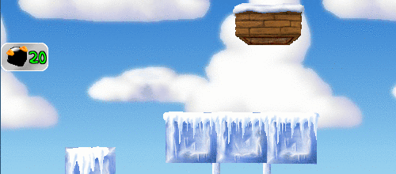

<head>
    <title>On Porting Pingus from C++ to Céu</title>
    <meta http-equiv="Content-Type" content="text/html; charset=UTF-8"/>
</head>

<!--
silentcast, transparent window interior, dont go under the default size
convert output.gif -fuzz 10% -layers Optimize optimised.gif
convert -delay 200 -loop 0 *.png state-anim.gif

TODO:
    - ver os patterns do GPP
        - nao cubro algum que ocorre no pingus?
        - cubro algum com nome diferente?
        - cubro algum que o GPP nao cobre?
    - hierarchy
        - exemplo de z-order lexico em vez de dinamico

TODO:
    - only control flow advances
        - no type inference
        - no GC
        - no functional compositions
        - no data abstraction
        - no rearrange of overall arch

- GOALS: stress-test the language
    - robustness
        - silly bugs (untested stuff)
    - programability
        - everyday stuff
            - maths, vectors
    - performance
        - FPS, RAM, ROM
    - false positives (too much?)
        - tight loops
    - C tricks: {}, _XXX, etc

- TODO: threads, lua

- compare to actors
    - parallel, synchronous-run-to-completion
    - not a loop+queue
-->

* [What](#what-is-this-all-about),
  [Why](#why-porting-pingus-to-céu),
  [How](#how-to-port),
  [Who](#who)?
* [Detailed Evaluation](#detailed-evaluation)

<!--
* [TLDR!](#tldr!)
    - did you do a complete port?
    - why is this cool?
    - ok, but with which gains in productivity?
    - what about CPU,ROM,RAM?
-->

# What is this all about?


<br/>


This report documents the process of porting the video game Pingus
&#91;[X][pingus-1],[X][pingus-2]&#93;
from C++ to the programming language Céu
&#91;[X][ceu-1],[X][ceu-2]&#93;.

[pingus-1]: http://pingus.seul.org/
[pingus-2]: https://github.com/Pingus/pingus/
[ceu-1]: http://ceu-lang.org/
[ceu-2]: https://github.com/fsantanna/ceu/

## Warming Up!


Let's consider the case of handling double clicks in the game.

In Pingus, double clicking the *Armageddon button* literally explodes all 
pingus, as illustrated in the figure in the right.

The code in C++ &#91;[X][cpp-armageddon]&#93; implements the class 
`ArmageddonButton` with methods for rendering and handling events.
Here, we focus on detecting the double click, hiding unrelated parts:

```
ArmageddonButton::ArmageddonButton(<...>):
    RectComponent(<...>),
    <...>
    pressed(false);                         // line X1
    press_time();                           // line X3
    <...>
{
    <...>
}

void ArmageddonButton::draw (<...>) {       // X10
    <...>
}                                           // X11

void ArmageddonButton::update (float delta) {
    <...>
    if (pressed) {                          // line X9
        press_time += delta;                // line X4
        if (press_time > 1.0f) {
            pressed = false;                // line X5
            press_time = 0;                 // line X6
        }
    } else {
        pressed = false;
        press_time = 0;
    }
}

void ArmageddonButton::on_primary_button_click (<...>) {
    if (pressed) {                          // line X8
        server->send_armageddon_event();    // line X7
    } else {
        pressed = true;                     // line X2
    }
}
```

The class first initializes the variable `pressed` to track the first click 
(ln. X1,X2).
It also initializes the variable `press_time` to count the time since the first 
click (ln. X3,X4).
If another click occurs within 1 second, the class signals the double click to 
the application (ln. X7).
Otherwise, the `pressed` and `press_time` state variables are reset (ln. 
X5-X6).

The methods `update` and `on_primary_button_click` are examples of
*short-lived callbacks*, which are pieces of code that execute in reaction to 
external input events.
Here, `on_primary_button_click` reacts to mouse clicks, while `update` 
continuously reacts to the passage of time.
Callbacks are short lived because they must execute as fast as possible to keep 
the game with real-time responsiveness.
Because callbacks are short lived, the only way they can affect each other is 
by manipulating persisting member variables in the object.
These *state variables* retain their values across multiple invocations, e.g.:
`on_primary_button_click` writes to `pressed` in the first click, and checks 
its state in further clicks (ln. X2,X8),
In the meantime, `update` also checks for `pressed` and may change its state 
(ln. X9,X5).

However, note how the accesses to these state variables are spread across the 
entire class.
For instance, the distance between the initialization of `pressed` (ln. X1) and 
the last access to it (ln. X2) is over 40 lines in the original file 
&#91;[X][cpp-armageddon-2]&#93;.
Arguably, this dispersion of code across methods makes the understanding and 
maintenance of the double-click behavior more difficult.
Also, even though the state variables are private, unrelated methods such as 
`draw` (ln. X10-X11) can potentially access it.

Céu provides structured constructs to deal with events, aiming to eradicate 
explicit manipulation of state variables for control-flow purposes.
The equivalent code in Céu &#91;[X][ceu-armageddon]&#93; defines the class 
`ArmageddonButton` as follows:

```
class ArmageddonButton with
    <...>
do                                                      // X9
    var RectComponent component = <...>;
    <...>
    loop do                                             // line X1
        await component.on_primary_button_click;        // line X3
        watching 1s do                                  // line X4
            await component.on_primary_button_click;    // line X6
            break;                                      // line X7
        end                                             // line X5
    end                                                 // line X2
    <...>
    emit global:go_armageddon;                          // line X8
end                                                     // X10
```

Instead of *objects*, classes in Céu specify *organisms* with a body 
declaration (ln. X9-X10) which executes for each instance while alive.
Unlike objects, an organism is an active entity and starts to execute its body 
in a concurrent and deterministic manner with other alive organisms (but *not* 
actually in parallel).
An execution body can use control-flow statements that keep the execution 
context across event occurrences (i.e., across `await` statements).

The double click detection is a `loop` (ln. X1-X2) that awaits the first click 
(ln. X3) and then, watching 1 second (ln. X4-X5), awaits the second click (ln 
X6).
If the second click occurs within 1 second, we `break` the loop (ln. X7) and 
signal the double click to the application (ln X8).
Otherwise, the `watching` block as a whole aborts and restarts the loop, 
falling back to the first click `await` (ln X3).

The double click detection in Céu doesn't require state variables and is 
entirely self-contained in the `loop` body (ln. X1-X2).
Furthermore, these 7 lines of code do nothing besides detecting a double click, 
i.e., the actual effect happens outside the loop (ln. X8).

As we argue throughout the document, appropriate control-flow mechanisms (e.g., 
`await` and `watching`) helps on the structure and composition of code, leading 
to considerable gains in productivity.

[cpp-armageddon]: https://github.com/Pingus/pingus/blob/v0.7.6/src/pingus/components/action_button.cpp
[cpp-armageddon-2]: https://github.com/Pingus/pingus/blob/v0.7.6/src/pingus/components/action_button.cpp#L33-#L90
[ceu-armageddon]: https://github.com/fsantanna/pingus/blob/ceu/ceu/pingus/components/action_button.ceu

# Why porting Pingus to Céu?

The main motivation to port Pingus from C++ to Céu is to promote its 
programming model in the context of video games.
Céu supports concurrent and deterministic abstractions to specify entities with 
a high degree of real-time interactions, such as in video game simulation.


According to Tim Sweeney (of Unreal Engine fame), about half of the development 
complexity resides in the *game simulation* code &#91;[X][sweeney]&#93;.
If we consider that *numeric computation* and *shading* do not vary from game 
to game (i.e., they are part of a game engine), the tendency is to shift the 
complexity even more towards game simulation.
Furthermore, only 10% of the CPU budget goes to game simulation, opening an 
opportunity for gains in productivity.

[sweeney]: https://www.cs.princeton.edu/~dpw/popl/06/Tim-POPL.ppt

<!--
When updating 10,000 objects at 60 FPS, everything is performance-sensitive
But:
Productivity is just as important
Will gladly sacrifice 10% of our performance
for 10% higher productivity
We never use assembly language

Gameplay Simulation
Gratuitous use of mutable state
10,000’s of objects must be updated
Typical object update touches 5-10 other objects

This is the hardest problem…
10,00’s of objects
Each one contains mutable state
Each one updated 30 times per second
Each update touches 5-10 other objects
 
Manual synchronization (shared state concurrency) is 
hopelessly intractible here.
 
Solutions?
Rewrite as referentially-transparent functions?
Message-passing concurrency?
Continue using the sequential, single-threaded approach?

Update all objects concurrently in arbitrary order, with each update wrapped in 
an atomic {...} block.
With 10,000’s of updates, and 5-10 objects touched per update, collisions will 
be low.
~2-4X STM performance overhead is acceptable:
if it enables our state-intensive code to scale to many threads, it’s still a win

Claim: Transactions are the only plausible solution to concurrent mutable state
-->

Besides promoting the concurrency model of Céu, we enumerate additional 
motivations for this report as follows:

* Expose Céu to a real code base that was neither specified nor implemented by 
  the designers of language.
  Even though video games match its domain, Céu is still primarily an academic 
  "toy" language.
  Also, a real-world project consists of a range of requirements, forcing us to 
  transpose the "academic fences" of papers, which usually only explore
  idiomatic code.
* Exercise the interface between Céu and C/C++.
  Céu is designed to integrate seamlessly with C.
  This allowed us to perform a *live porting*, i.e., we incrementally ported 
  code from C++ to Céu without breaking the game for long.
* Serve as a deep and comprehensive guide for developers interested in trying 
  Céu.
  We discuss a number of game behaviors with an in-depth comparison between the 
  original code in C++ and the equivalent code ported to Céu.
* Stress-test the implementation of Céu.
  Academic artifacts typically do not go beyond working prototypes.
  We also want Céu to be a robust and practical language for everyday use.
* Evaluate the performance of Céu.
  Having C++ as a benchmark, how does Céu compare in terms of memory usage, 
  code size, and execution time (e.g., FPS rate)?

# How to port?

The general idea is to identify control-flow patterns that encompass successive 
reactions to events, which imply crossing multiple method invocations in C++.
We then rewrite these patterns in a class in Céu, using appropriate structured 
constructs, and redirect the instantiation and event dispatching to the new 
class.
The remaining classes in C++ should interoperate with the new classes in Céu 
until we complete the porting process.

Note that we only touch classes that deal with events, as Céu is actually less 
expressive than C++ for pure data manipulation.
Hence, we rely on the integration between Céu and C/C++ and take advantage of 
the existing code base and libraries.

To identify these control-flow patterns, we inspect the C++ class definitions 
searching for members with suspicious names (e.g.,
[`pressed`][state-pressed],
[`particle_thrown`][state-particle-thrown],
[`mode`][state-mode], or
[`delay_count`][state-delay-count]).
Good chances are that variables with identifiers resembling verbs, status, or 
counters encode some form of control-flow progression that cross multiple 
callback invocations.

[state-pressed]: https://github.com/Pingus/pingus/blob/v0.7.6/src/pingus/components/action_button.hpp#L36
[state-particle-thrown]: https://github.com/Pingus/pingus/blob/v0.7.6/src/pingus/actions/bomber.hpp#L31
[state-mode]: https://github.com/Pingus/pingus/blob/v0.7.6/src/pingus/actions/bridger.hpp#L30
[state-delay-count]: https://github.com/Pingus/pingus/blob/v0.7.6/src/pingus/actions/digger.hpp#L32

We believe that most difficulties in implementing control behavior in games is 
not inherent to this domain, but the result of accidental complexity due to the 
lack of structured abstractions and appropriate concurrency models to handle 
event-based applications.

During the course of the porting process, and following the class-by-class 
identification described above, we could extract more abstract control patterns 
that should apply to other games.
Our hypothesis is that other games manifesting such patterns must use some form 
of explicit state which are likely subject to the same porting process.

## Control-Flow Patterns in Pingus

We identified seven evident control-flow patterns in Pingus which we discuss 
further with in-depth examples:

1. **Finite State Machines**
    State machines describe the behavior of game entities by mapping event 
    occurrences to transitions between states triggering appropriate actions.

2. **Dispatching Hierarchies**
    Some entities in games act as containers for other child entities,
    resulting in hierarchies of event dispatching.

3. **Continuation Passing**
    The completion of long-lasting activity in a game may have a continuation, 
    i.e., some action to execute next.

4. **Signaling Mechanisms**
    Entities often need to communicate explicitly through a signaling 
    mechanism, especially if there is no hierarchy relationship between them.

5. **Wall-Clock Timers**
    Wall-clock timers measure the passage of time from the real world
    (e.g., *10 seconds*) such as for periodic sampling and timeout watchdogs.

6. **Pausing**
    Pausing allows parts of the game to temporarily suspend execution or
    reactions to incoming events.

7. **Resource Acquisition and Release**
    External resources, such as configuration files and saved games,
    must be acquired and properly released.

<!-- TODO: are these terms and explanations symmetric? -->

# Who?

Francisco Sant'Anna

* http://www.ceu-lang.org/chico/
* https://github.com/fsantanna/
* [@fsantanna_puc](https://twitter.com/fsantanna_puc/)

## Acknowledgments

Leonardo Kaplan
* https://github.com/leokaplan/

Alexander Tkachov
* https://github.com/Tkachov/

-------------------------------------------------------------------------------

# Detailed Evaluation

## Qualitative Analysis

Selected Code Snippets

<!--
3. **Continuation Passing**
    The completion of long-lasting activity in a game may have a continuation, 
    i.e., some action to execute next.

    If the execution flow is dynamic, the program has to tell the activity 
    where to go when it completes.
    In Pingus, when the player terminates a level, the game may terminate or
    return to the main menu, depending on how it was invoked from the command
    line.

4. **Signaling Mechanisms**
    Entities often need to communicate explicitly through a signaling 
    mechanism, especially if there is no hierarchy relationship between them.

    As illustrated in the figure in the right, the clicking the checkbox 
    toggles the *Mouse Grab* flag.
    However, at any point in the game (even outside the *Option Menu*), 
    pressing *Ctrl-G* also toggles the same flag, which should adjust the
    checkbox accordingly.

5. **Wall-Clock Timers**
    Wall-clock timers measure the passage of time from the real world
    (e.g., *10 seconds*) such as for periodic sampling and timeout watchdogs.

    The double click behavior above uses a timeout of 1 second to restart.

6. **Pausing**
    Pausing allows parts of the game to temporarily suspend execution or
    reactions to incoming events.

    In Pingus, the player can press a button in the screen to toggle between 
    pause and resume.

7. **Resource Acquisition and Release**
    External resources, such as configuration files and saved games,
    must be acquired and properly released.

    TODO
-->

### Finite State Machines

State machines describe the behavior of game entities by mapping event 
occurrences to transitions between states triggering appropriate actions.
<!--
The double click behavior for the *Armageddon button* is an example of a simple 
state machine.
-->

#### The "Bomber" Action


<br/>


The *bomber action* explodes the clicked pingu, throwing particles around and 
also destroying the terrain under its radius.
A sequential state machine models an animation with actions associated to 
specific frames, as illustrated in the figure in the right and as follows:

1. 0th frame: plays a "Oh no!" sound.
2. 10th frame: plays a "Bomb!" sound.
3. 13th frame: throws particles, destroys the terrain, shows an explosion sprite
4. Game tick: hides the explosion sprite
5. Last frame: kills the pingu

*(Open [this video][youtube-bomber] to listen to the sound effects.)*

[youtube-bomber]: https://youtu.be/QLXIT59il6o?t=306

The code in C++ &#91;[X][cpp-bomber]&#93; defines the class `Bomber` which implements 
the `draw` and `update` callback methods:

```
Bomber::Bomber (Pingu* p) :
    <...>
    sound_played(false),        // tracks state 2   X1
    particle_thrown(false),     // tracks state 3
    colmap_exploded(false),     // tracks state 3
    gfx_exploded(false)         // tracks state 4   X2
{
    <...>
    // 1. 0th frame: plays a "Oh no!" sound.
    WorldObj::get_world()->play_sound("ohno", pingu->get_pos ());   // X3
}

void Bomber::update ()
{
    sprite.update ();               // X4
    <...>   // pingu movement       // X4.1

    // 2. 10th frame: plays a "Bomb!" sound.
    if (sprite.get_current_frame()==10 && !sound_played) {              // X5
        sound_played = true;
        WorldObj::get_world()->play_sound("plop", pingu->get_pos ());
    }                                                                   // X6

    // 3. 13th frame: throws particles, destroys the terrain, shows an explosion sprite
    if (sprite.get_current_frame()==13 && !particle_thrown) {           // X7
        particle_thrown = true;
        WorldObj::get_world()->get_pingu_particle_holder()->add_particle(pingu->get_x(),
                                                                         pingu->get_y()-5);
    }
    if (sprite.get_current_frame()==13 && !colmap_exploded) {
        colmap_exploded = true;
        WorldObj::get_world()->remove(bomber_radius, <...>);
    }                                                                   // X8

    // 5. Last frame: kills the Pingu
    if (sprite.is_finished ()) {                                        // X12
        pingu->set_status(Pingu::PS_DEAD);                              // X13
    }
}

void Bomber::draw (SceneContext& gc) {
    // 3. 13th frame: throws particles, destroys the terrain, shows an explosion sprite
    // 4. Game tick: hides the explosion sprite
    if (sprite.get_current_frame()==13 && !gfx_exploded) {              // X9
        gfx_exploded = true;                                            // X10
        gc.color().draw (explo_surf, <...>);                            // X11
    }
    gc.color().draw(sprite, pingu->get_pos ());
}
```

The class defines one state variable for each action to perform (ln. X1-X2).
The "Oh no!" sound plays as soon as the object starts in *state-1* (ln. X3).
The `update` callbacks update the animation sprite and moves the pingu every 
frame (ln.  X4-X4.1), regardless of the current state.
When the animation reaches the 10th frame, it plays the "Bomb!" if it hasn't 
yet (ln. X5-X6), going to *state-2*.
The `sound_played` state variable is required because the sprite frame doesn't 
necessarily advance on every `update` invocation.
The same reasoning and technique applies to the *state-3* (ln. X7-X8 and 
X9-X10).
The explosion sprite appears in a single frame in *state-4* (ln. X11).
Finally, the pingu dies after the animation frames terminate (ln. X12-X13).

Note that a single numeric state variable would suffice to track the states.
Probably, the authors chose to encode each state in an independent boolean 
variable to rearrange and experiment with them during the development.

However, due to the short-lived nature of callbacks, state variables are 
unavoidable, being part of the essence of object-oriented programming (methods 
+ mutable state).

The implementation in Céu doesn't require explicit state variables and more 
closely reflects in the source code the sequential state machine:

```
class Bomber with
    <...>
do
    <...>
    par do
        <...>   // pingu movement                                   // X1
    with
        // 1. 0th frame: plays a "Oh no!" sound.
        call {Sound::PingusSound::play_sound}("ohno", 0.5, 0.0);

        // 2. 10th frame: plays a "Bomb!" sound.
        await WORLD_UPDATE until sprite.get_current_frame() == 10;
        call {Sound::PingusSound::play_sound}("plop", 0.5, 0.0);

        // 3. 13th frame: throws particles, destroys the terrain, shows an explosion sprite
        await WORLD_UPDATE until sprite.get_current_frame() == 13;
        emit global:go_create_pingu_particles => (this.pingu.get_x(),
                                                  this.pingu.get_y()-5);
        global:world!:remove(&&_bomber_radius, <...>);
        do                                                          // X4
            var Sprite s = Sprite.build_name(<...>, &&explo);
            // 4. Game tick: hides the explosion sprite
            await WORLD_UPDATE;
        end                                                         // X5

        // 5. Last frame: kills the pingu
        await sprite;                                               // X2
        escape {ActionName::DEAD};                                  // X3
    end
end
```

Considering the implementation in Céu, we can highlight some benefits in 
comparison to the implementation in C++:

- We encode all states implicitly, relying on the natural sequential flow of 
  execution.
- We handle all states (and only them) in the same contiguous block of code.
- We isolate unrelated behaviors to the animation, such as the pingu movement 
  (ln. X1), in a parallel line of execution.
- We use a local and lexically-scoped organism
  (to be discussed [X][hierarchical-dispatching])
  for the temporary single-frame explosion (ln. X4-X5).
- We use auxiliary signalling mechanisms
  (to be discussed [X][signalling-mechanisms])
  to await the termination of the animation (ln.  X2) and
  to notify the application about our own termination.

[cpp-bomber]: https://github.com/Pingus/pingus/blob/v0.7.6/src/pingus/actions/bomber.cpp
[ceu-bomber]: https://github.com/fsantanna/pingus/blob/ceu/ceu/pingus/actions/bomber.ceu

<!--
#### Sprite Animations
-->

### Dispatching Hierarchies

Some entities in games act as containers for other child entities,
resulting in hierarchies of event dispatching.
<!--
    In Pingus, the *Main Menu* in the figure above is represented as a 
    container class with five buttons as children.
    When a button click occurs, it is first dispatched to the container class,
    which may take an action before deciding to forward the event (or not) to 
    the buttons.
-->

#### Bomber `draw` and `update` callbacks

Let's dig into the `Bomber` animation in C++ &#91;[X][cpp-bomber]&#93;, 
focusing on the `sprite` member, and the `update` and `draw` callback methods:

```
// bomber.hpp/cpp

class Bomber : public PinguAction
{
    <...>
    Sprite sprite;
    void draw (SceneContext& gc);
    void update();
}

Bomber::Bomber (<...>) : <...>
{
    sprite.load(<...>);                     // X1
    <...>
}

void Bomber::update () {                    // X2
    sprite.update ();
}                                           // X3

void Bomber::draw (SceneContext& gc) {      // X4
    <...>
    gc.color().draw(sprite, <...>);
}                                           // X5
```

The class loads the `sprite` in the constructor (ln. X1) and continually 
redirects `update` and `draw` to it (ln. X2-X3 and X4-X5).
The `Sprite` class &#91;[X][cpp-sprite]&#93; knows how to update 
&#91;[X][cpp-sprite-update]&#93; and render &#91;[X][cpp-sprite-render]&#93; 
itself.

However, we have to follow a long hierarchy of 8 dispatches to understand how 
the `update` and `draw` callbacks flow from the original stimulus from the 
environment down to the sprite:

0. `ScreenManager::display` &#91;[X][cpp-screenmanager-1]&#93;
        (the game loop)
   calls
   `this->update` &#91;[X][cpp-screenmanager-2]&#93;
        (in the same class).
1. `ScreenManager::update` &#91;[X][cpp-screenmanager-1]&#93;
   calls
   `last_screen->update` &#91;[X][cpp-screenmanager-2]&#93;
        (for the active game screen).
2. `GUIScreen::update` &#91;[X][cpp-guiscreen-1]&#93;
        (the base class for all game screens)
   calls
   `gui_manager->update` &#91;[X][cpp-guiscreen-2]&#93;
        (for the container holding all screen components).
3. `GroupComponent::update` &#91;[X][cpp-groupcomponent-1]&#93;
        (for the `gui_manager`)
   calls
   `child->update` &#91;[X][cpp-groupcomponent-2]&#93;
        (for each sub-component in the screen).
4. `World::update` &#91;[X][cpp-world-1]&#93;
        (child of the `GameSession` screen)
   calls
   `obj->update` &#91;[X][cpp-world-2]&#93;
        (for each object in the world).
5. `PinguHolder::update` &#91;[X][cpp-pinguholder-1]&#93;
        (child of `World`)
   calls
   `pingu->update` &#91;[X][cpp-pinguholder-2]&#93;
        (for each pingu alive).
6. `Pingu::update` &#91;[X][cpp-pingu-1]&#93;
   calls
   `action->update` &#91;[X][cpp-pingu-2]&#93;
        (for the active pingu action).
7. `Bomber::update` &#91;[X][cpp-bomber-1]&#93;
   calls
   `sprite.update` &#91;[X][cpp-bomber-2]&#93;.
8. `Sprite::update` &#91;[X][cpp-sprite-1]&#93;
   finally updates the animation frames.

[cpp-screenmanager-1]: https://github.com/Pingus/pingus/blob/v0.7.6/src/engine/screen/screen_manager.cpp#L164
[cpp-screenmanager-2]: https://github.com/Pingus/pingus/blob/v0.7.6/src/engine/screen/screen_manager.cpp#L218
[cpp-screenmanager-1]: https://github.com/Pingus/pingus/blob/v0.7.6/src/engine/screen/screen_manager.cpp#L235
[cpp-screenmanager-2]: https://github.com/Pingus/pingus/blob/v0.7.6/src/engine/screen/screen_manager.cpp#L258
[cpp-guiscreen-1]: https://github.com/Pingus/pingus/blob/v0.7.6/src/engine/screen/gui_screen.cpp#L44
[cpp-guiscreen-2]: https://github.com/Pingus/pingus/blob/v0.7.6/src/engine/screen/gui_screen.cpp#L46
[cpp-groupcomponent-1]: https://github.com/Pingus/pingus/blob/v0.7.6/src/engine/gui/group_component.cpp#L58
[cpp-groupcomponent-2]: https://github.com/Pingus/pingus/blob/v0.7.6/src/engine/gui/group_component.cpp#L63
[cpp-world-1]: https://github.com/Pingus/pingus/blob/v0.7.6/src/pingus/world.cpp#L146
[cpp-world-2]: https://github.com/Pingus/pingus/blob/v0.7.6/src/pingus/world.cpp#L183
[cpp-pinguholder-1]: https://github.com/Pingus/pingus/blob/v0.7.6/src/pingus/pingu_holder.cpp#L89
[cpp-pinguholder-2]: https://github.com/Pingus/pingus/blob/v0.7.6/src/pingus/pingu_holder.cpp#L95
[cpp-pingu-1]: https://github.com/Pingus/pingus/blob/v0.7.6/src/pingus/pingu.cpp#L311
[cpp-pingu-2]: https://github.com/Pingus/pingus/blob/v0.7.6/src/pingus/pingu.cpp#L339
[cpp-bomber-1]: https://github.com/Pingus/pingus/blob/v0.7.6/src/pingus/actions/bomber.cpp#L58
[cpp-bomber-2]: https://github.com/Pingus/pingus/blob/v0.7.6/src/pingus/actions/bomber.cpp#L60
[cpp-sprite-1]: https://github.com/Pingus/pingus/blob/v0.7.6/src/engine/display/sprite_impl.cpp#L112

Pingus keeps track of a stack of screens (e.g., Menu, World Map, Game Play, 
etc.) and only dispatches events to the one at the top.
The game loop &#91;[X][pingus-gameloop]&#93; of Pingus resides in the 
`ScreenManager` class, method `display` &#91;[X][cpp-screenmanager]&#93;:

```
// screen_manager.hpp/cpp

class ScreenManager
{
    <...>
    std::vector<std::shared_ptr<Screen> > screens;
    void display();
    void update(float delta, <...>);
}

void ScreenManager::display() {
    Uint32 last_ticks = SDL_GetTicks();
    float previous_frame_time;

    while (!screens.empty()) {                  // X1
        Uint32 ticks = SDL_GetTicks();                      // X3
        previous_frame_time  = (ticks - last_ticks)/1000;
        last_ticks = ticks;                                 // X4
        <...>
        update(previous_frame_time, <...>);
    }                                           // X2
}

void ScreenManager::update(float delta, <...>) {
    ScreenPtr last_screen = get_current_screen();
    <...>
    last_screen->update(delta);                 // X5
    last_screen->draw(<...>);                   // X6
    <...>
}
```

Every iteration of the loop (ln. X1-X2) calculates the time elapsed between two 
frames (ln. X3-X4) and dispatches `update` and `draw` to the active screen (ln.  
X5-X6).

The `Bomber` action occurs during game play, in the `GameSession` screen class 
&#91;[X][cpp-gamesession]&#93;.
All game screens extends `GUIScreen` &#91;[X][cpp-guiscreen]&#93;, which 
contains a `gui_manager` holding all sub-components to `update` and `redraw`:

```
// gui_screen.hpp/cpp

class GUIScreen : public Screen
{
    <...>
    std::unique_ptr<GUI::GUIManager> gui_manager;
    virtual void draw(DrawingContext& gc);
    virtual void update (float);
}

void GUIScreen::draw(DrawingContext& gc)
{
    <...>
    gui_manager->draw(gc);
}

void GUIScreen::update(float delta) {
    gui_manager->update(delta);
}
```

The `GUIManager` class &#91;[X][cpp-guimanager]&#93; extends `GroupComponent` 
&#91;[X][cpp-groupcomponent]&#93;, which does the relevant work, holding all 
sub-components and dispatching the `update` and `draw` methods to them:

```
// group_component.hpp/cpp

class GroupComponent : public RectComponent
{
    std::vector<Component*> children;
    <...>
    void add(Component* comp);
    void draw(DrawingContext& gc);
    void update(float delta);
}

GroupComponent::GroupComponent(const Rect& rect_, bool clip_) :
    <...>
    children()
{
}

GroupComponent::~GroupComponent() {
    for(Components::iterator i = children.begin(); i != children.end(); ++i) {
        delete *i;
    }
}

void GroupComponent::add(Component* comp) {
    <...>
    children.push_back(comp);
}

void GroupComponent::draw (DrawingContext& parent_gc)
{
    for(Components::iterator i = children.begin(); i != children.end(); ++i) {
        if ((*i)->is_visible())
            (*i)->draw(drawing_context);
    }
    <...>
}

void GroupComponent::update (float delta) {
    for(Components::iterator i = children.begin(); i != children.end(); ++i) {
        if ((*i)->is_visible())
            (*i)->update(delta);
    }
}
```

Among all `GameSession` sub-components &#91;[X][cpp-gamesession-subs]&#93;, the 
`World` class is yet another container holding the actual concrete and 
recognizable game entities, such as all pingus, terrains, and traps 
&#91;[X][cpp-world-hpp]&#93;:

```
// world.hpp

class World
{
    <...>
    std::vector<WorldObj*> world_obj;       // X1
    PinguHolder* pingus;                    // X2
    void draw (SceneContext& gc);
    void update ();
}

// world_obj.hpp

class WorldObj
{
    <...>
    virtual void draw(SceneContext& gc) = 0;
    virtual void update ();
}

// pingu_holder.hpp

class PinguHolder : public WorldObj
{
    <...>
    std::list<Pingu*> pingus;
    Pingu* create_pingu(const Vector3f& pos, int owner_id);
    void draw (SceneContext& gc);
    void update();
}
```

The `World` holds all `WorldObj` instances into another container `world_obj` 
(ln.  X1).
In particular, `world_obj` holds all `pingus` (ln. X2) in a `PinguHolder` class 
extending `WorldObj` as follows &#91;[X][cpp-world-cpp]&#93;:

```
// world.cpp

World::World(const PingusLevel& plf) :
    <...>
    pingus(new PinguHolder(plf)),           // X3
{
    <...>
    world_obj.push_back(pingus);            // X4
}

World::~World() {
    for (WorldObjIter it = world_obj.begin(); it != world_obj.end(); ++it) {
        delete *it;
    }
}

void World::draw (SceneContext& gc)
{
    <...>
    for(WorldObjIter obj = world_obj.begin(); obj != world_obj.end(); ++obj) {
        (*obj)->draw(gc);
    }
}

void World::update()
{
    <...>
    for(WorldObjIter obj = world_obj.begin(); obj != world_obj.end(); ++obj) {
        (*obj)->update();
    }
}
```

The `PinguHolder` class receives the `update` and `draw` calls from the `World` 
and redirects them to each individual pingu &#91;[X][cpp-pinguholder]&#93;:

```
PinguHolder::PinguHolder(const PingusLevel& plf) :
  <...>
  pingus()
{
}

PinguHolder::~PinguHolder() {
    for(std::vector<Pingu*>::iterator i = pingus.begin(); i != pingus.end(); ++i) {
        delete *i;
    }
}

Pingu* PinguHolder::create_pingu (<...>) {
    <...>
    pingu = <...>;
    pingus.push_back(pingu);
    return pingu;
}

void PinguHolder::draw (SceneContext& gc) {
    <...>
    for(std::list<Pingu*>::iterator pingu=pingus.begin(); pingu!=pingus.end(); ++pingu) {
        <...>
        (*pingu)->draw(gc);
    }
}

void PinguHolder::update() {
    PinguIter pingu = pingus.begin();
    while(pingu != pingus.end()) {
        (*pingu)->update();
        <...>
        if ((*pingu)->get_status() == Pingu::PS_DEAD) {
            pingu = pingus.erase(pingu);
        }
        <...>
        ++pingu;
    }
}
```

Finally, the `Pingu` class &#91;[X][cpp-pingu]&#93; holds the current 
`PinguAction` &#91;[X][cpp-pinguaction]&#93;, which `Bomber` extends, and 
redirects `update` and `draw` invocations to it:

```
// pingu.hpp/cpp

class Pingu
{
    <...>
    std::shared_ptr<PinguAction> action;            // current action
    void draw (SceneContext& gc);
    void update();
}

Pingu::Pingu (int arg_id, const Vector3f& arg_pos, int owner) :
    <...>
    action()
{
    <...>
    action = create_action(ActionName::FALLER);     // initial action
}

void Pingu::update() {
    <...>
    action->update();
}

void Pingu::draw(SceneContext& gc)
{
    <...>
    action->draw(gc);
}

// pingu_action.hpp

class PinguAction
{
    <...>
    virtual void update () = 0;
    virtual void draw (SceneContext& gc) =0;
}
```


, andetc.

, which is reached from `Playfield`, &#91;[X][cpp-gamesession-subs]&#93;

to see which sub-components it holds

The two containers, `GroupComponent` and `World` are the owners
call `delete`
    - group and world have no "remove" per item
    - they are "static"
    - world has sub containers,e.g., for pingus, that are dynamic,
        with pre-item "remove"

- tradeoff here is clear
    - indirect reaction + dynamic scope
    vs
    - direct reaction + lexical scope

class GameSession : public GUIScreen
class GUIScreen : public Screen

- class hier and dispatch hier

- no lapsed listener
- no dynamic allocation or GC
- static reasoning
- inheritance vs composition
- no hier b/c orgs can react directly to the env
    + lexical scope
- animation w/ the dispatch path

[cpp-sprite]: https://github.com/Pingus/pingus/blob/v0.7.6/src/engine/display/sprite_impl.cpp
[cpp-sprite-update]: https://github.com/Pingus/pingus/blob/v0.7.6/src/engine/display/sprite_impl.cpp#L111
[cpp-sprite-render]: https://github.com/Pingus/pingus/blob/v0.7.6/src/engine/display/sprite_impl.cpp#L139

[cpp-screenmanager]: https://github.com/Pingus/pingus/blob/v0.7.6/src/engine/screen/screen_manager.cpp#L163
[cpp-gamesession]: https://github.com/Pingus/pingus/blob/v0.7.6/src/pingus/screens/game_session.hpp
[cpp-gamesession-subs]: https://github.com/Pingus/pingus/blob/v0.7.6/src/pingus/screens/game_session.cpp#L80
[cpp-guiscreen]: https://github.com/Pingus/pingus/blob/v0.7.6/src/engine/screen/gui_screen.hpp

[cpp-guimanager]: https://github.com/Pingus/pingus/blob/v0.7.6/src/engine/gui/gui_manager.hpp
[cpp-groupcomponent]: https://github.com/Pingus/pingus/blob/v0.7.6/src/engine/gui/group_component.cpp
<!--
[cpp-rectcomponent]: https://github.com/Pingus/pingus/blob/v0.7.6/src/engine/gui/rect_component.hpp
[cpp-component-hpp]: https://github.com/Pingus/pingus/blob/v0.7.6/src/engine/gui/component.hpp
-->

[cpp-world-hpp]: https://github.com/Pingus/pingus/blob/v0.7.6/src/pingus/world.hpp
[cpp-world-cpp]: https://github.com/Pingus/pingus/blob/v0.7.6/src/pingus/world.cpp
[cpp-pinguholder]: https://github.com/Pingus/pingus/blob/v0.7.6/src/pingus/pingu_holder.cpp

[cpp-pingu]: https://github.com/Pingus/pingus/blob/v0.7.6/src/pingus/pingu.cpp
[cpp-pinguaction]: https://github.com/Pingus/pingus/blob/v0.7.6/src/pingus/pingu_action.hpp

<!--
new Server
https://github.com/Pingus/pingus/blob/v0.7.6/src/pingus/screens/game_session.cpp#L55

new World
https://github.com/Pingus/pingus/blob/v0.7.6/src/pingus/server.cpp#L77

world->draw()
https://github.com/Pingus/pingus/blob/v0.7.6/src/pingus/components/playfield.cpp#L66

server->update()
https://github.com/Pingus/pingus/blob/v0.7.6/src/pingus/screens/game_session.cpp#L159

world->update()
https://github.com/Pingus/pingus/blob/v0.7.6/src/pingus/server.cpp#L103
-->


## Quantitative Analysis

### Code Size

### Memory

### CPU

<!--
## The Game Loop

The *game loop* determines the general structure of virtually all games 
&#91;[X][gpp-gameloop]&#93; (Pingus is no different &#91;[X][pingus-gameloop]&#93;):

```
while (true)
{
    processInput();
    update();
    render();
}
```

> A game loop runs continuously during gameplay.
> Each turn of the loop, it processes user input without blocking, updates the 
> game state, and renders the game.
> It tracks the passage of time to control the rate of gameplay.

The `update` function does the hard work, dealing with the state of all game 
entities, and has to execute as fast as possible to keep real-time 
responsiveness to input events.
However, short-lived functions such as `update` do not retain local variables 
and control-flow state across consecutive invocations.
In this sense, they eliminate any vestige of structured programming, becoming 
*our generation's goto* &#91;[X][goto]&#93;.

[gpp-gameloop]: http://gameprogrammingpatterns.com/game-loop.html
[pingus-gameloop]: https://github.com/Pingus/pingus/blob/v0.7.6/src/engine/screen/screen_manager.cpp#L172
[goto]: http://tirania.org/blog/archive/2013/Aug-15.html


## The Synchronous Concurrency Model

```
    initialize state;
    while (true) do
        read inputs;
        update state;
        write outputs;
    end
```

The game loop:
`ScreenManager::display`
https://github.com/fsantanna/pingus/blob/master/src/engine/screen/screen_manager.cpp#L164

```
void ScreenManager::display() {
    Uint32 old = SDL_GetTicks();

    while (!screens.empty()) {
        // READ INPUTS
        Uint32 now = SDL_GetTicks();
        Uint32 delta = now - old;
        old = now;
        <read-other-inputs>

        // UPDATE STATE
        screens.back()->update(delta);
        <update-other-inputs>

        // WRITE OUTPUTS
        screens.back()->draw(<...>);
        Display::flip_display();
    }
}
```

## Céu

<!-
- control
    = Accidental complexity
- not pure functions

- end of document
    - GC, why gcc doesn't solve: lapsed listeners
        - static mem, orgs, aliases, lexical scope
    - GC also doesn't solve resources:
Garbage collecting resources (file handles, etc):

This is a very different question, because resource freeing has observable 
consequences beyond performance and memory consumption - unlike garbage 
collection, which is justified by the realization that if you don't have any 
pointers to a value in memory, then it can simply dissapear (or not) without 
observable consequences.

For example, if you have a file handle open for writing, then other applications can't open that file. You want such resource usage to be clear and deterministic, so that files don't just remain open for a random duration depending on the garbage collector's internals.

In general, I would not advocate garbage collection of OS resources or any other thing requiring explicit cleanup. For example, I think that Java/C# finalizers are a misguided idea, because they have observable, nondeterministic consequences. That is exactly the sort of feature a high-level, secure language should avoid. The bizarre finalization state diagrams for those languages should be enough to indicate that something is wrong here!

For resource freeing, constructs which guarantee that every resource is freed look promising (think of wrapping a file handle in an abstraction like a Haskell State monad). Or just plain old handles with explicit closing (and thus the risk of not closing a handle, closing it when it's not open, etc).

Garbage collection without type information?

C++ garbage collection would greatly benefit if it was assisted by the compiler. During a scan, only pointers to objects need to be scanned. Unfortunately, it is not possible without assistance from the compiler. That is the reason third-party solutions are not good enough for performance-intensive applications.

Memory management and resource management is not the same. Resources other than memory are usually few in a program and not interconnected. A program may have files, sockets, windows and other types of handles, but usually these handles are 'dead ends', i.e. they do not contain references to other handles. Memory, on the other hand, is a totally different beast: a block of memory usually contains references to other blocks of memory. So the idea of finalizers is a bad one, since resources other than memory should be freed by RAII techniques (for deterministic resource management), but memory should be handled by garbage collector.

I will say it again, because no one seemed to notice it: could it be that there exists a "calculus" for resource management?
By Achilleas Margaritis at Fri, 2006-02-03 11:46 | login or register to post comment

->

## Idioms

<!-
All patterns relate to event handling and control flow in games, and we argue 
how Céu offers more appropriate abstractions than existing languages.

### State Machines

    At any time, the program can only be in a single state, which globally and 
    univocally represents the current XXX.
    This unique and global view of the program state as a single value has 
maintenance scalability problems (AKA the *state explosion phenomena*).
    - state machines vs await
    The more XXX, the more states to track, state explosion.
    The machine transits from state to state

, as we encode the fact

 It can change from one state to another when initiated by a triggering event 
or condition; this is called a transition.
    - state machines vs await

Map the whole behavior into a single number is a problem.
    - hierarchical machines can help, but still has this mapping property
        - locally unscallabe
        - still a data sultion to a control problem
        - explicit state machines vs implicit
        - incremental implementation requires global changes
            - in ceu, its just compositions

### Hierarchies

    - class hierarchies/dispatching vs await
    - difficult to track origin
        - has to traverse the whole hierarchy
    - used in pause
    - not class hier
    - flat dispatching (diagrama mostrando os dois)

 (e.g., a key press or expiring timer)
    - class hierarchies/dispatching vs await
    - lexical scope
    - visitor pattern

    - new /delete

### Continuations

    - CPS vs return continue
        - screen trasnitions
        - story screen advancing
        - story screen -> credits screen
        - WM pingu path traversal
        - worse w/o closures
    Typically, screen transitions are not static

### Signaling Between Entities

    - signaling/f pointer vs events
        - option save on click
        - global events double direction
            - key/mouse-but events
                - sendo que but tem que ficar highlight ou nao
        - verificar caso do option_menu
            - configuracao pode ser alterada por fora?
        - worse w/o closures

### Wall-Clock Timers
    - wall-clock time
        - story chars
        - credits up
        - fps
Activities that involve reactions to \emph{wall-clock time}%
\footnote{
By wall-clock time we mean the passage of time from the real world, measured in 
hours, minutes, etc.
}
appear in typical patterns of embedded development, such as timeout watchdogs 
and sensor samplings.
However, support for wall-clock time is somewhat low-level in existing 
languages, usually through timer callbacks or ``sleep'' blocking calls.

### Pausing
    - pause
        - alternative is again hierarchies which enable/disable forwarding
    - problem with timer callbacks

# Evaluation

- DOC: two main points:
    = WHY
        - state machines
        - C libraries
        - static memory
        - control safety
    = WHY NOT
        - functional, immutability
        - type safety
        - generic code
        - tooling
    = BOUNS: Lua
->

## The Code Base

Pingus has a code base around 40k lines of code (LoC):

    > cd pingus/src/
    > sloccount .
    ...
    SLOC	Directory	SLOC-by-Language (Sorted)
    18173   pingus          cpp=18173
    10073   engine          cpp=10073
    6532    editor          cpp=6532
    2771    util            cpp=2771
    1138    math            cpp=1138
    679     lisp            cpp=679
    365     win32           ansic=365
    248     macosx          objc=248
    7       top_dir         cpp=7

The code base includes a game engine, utilities, level editor, platform stubs, 
and the game logic.
Most of the porting process centered around the `engine` and `pingus` 
directory, as we did not port the level editor:

SLOC	Directory	SLOC-by-Language (Sorted)
6844    top_dir         cpp=6844
3045    screens         cpp=3045
2354    worldmap        cpp=2354
2118    worldobjs       cpp=2118
1838    actions         cpp=1838
1338    components      cpp=1338
531     particles       cpp=531
64      colliders       cpp=64
41      movers          cpp=41

SLOC	Directory	SLOC-by-Language (Sorted)
4666    display         cpp=4666
3617    input           cpp=3617
621     gui             cpp=621
603     screen          cpp=603
410     sound           cpp=410
109     resource        cpp=109
47      system          cpp=47

<!-
Most of

 `engine/`, a level `editor/`


Total Physical Source Lines of Code (SLOC)                = 39,986

The next Mainstream Programming Language, slides for his invited talk at POPL 2006
Video game programming has a
entities have a high degree of interdependence
current abstractions impose a high degree of accidental complexity

More concretely

- BUG: a cada reinicio, o dobro de pingus sao criados
- BUG: is_world=false in sprite.ceu
- BUG: cliques nos pingus
- BUG: bg do pingu counter fixo
- BUG: small map esta atras da agua embaixo do level snow20
- BUG: queda do pingu saindo da entrada esta levemente desalinhado
- BUG: glitch periodico no smallmap relacionado ao RENDER
- BUG: pequeno glitch no smallmap no inicio da fase
- BUG: procurar /// TODO: w/o me.ceu this function becomes @rec
- z-order front entrance snow-tutorial
- TODO: pos_offset em todos os objs em factory
- front entrance atras do pingu
- color.a em surface_background.ceu
- idle laser_exit
- EXIT/LASER_EXIT pega somente 1 de cada vez
    - verificar se o loop nao deveria pegar varios
- cache de sprites ou performance inviavel
- EXITER/LASERKILL in pingu.ceu
- BUG: climber center
- global:world.pingus vai simplificar min.ceu
- bug do WORLD_UPDATE necessario
- pingu! = <...>
- world! = <...>
- countdown action disable from the original??
- walker behind all
- bridger offset
- rename SpritePingus => Sprite
- testar climber, wall-mode-activation
- testar previous action: Climber->Jumper->direction-change/Blocker->Faller->Blocker
- SDL_DT p/ pingus/actions/sprites
->


<!-
# PORTING

```
native/pre do
    ##include "../src/engine/display/sprite.hpp"
end
native @plain _SpriteImpl;

input _SpriteImpl&& SPRITE_IMPL_NEW;
input _SpriteImpl&& SPRITE_IMPL_DELETE;

class SpriteImpl with
    var _SpriteImpl& me;
do
    par/or do
        var _SpriteImpl&& me_ = await SPRITE_IMPL_DELETE
                                until me_ == &&this.me;
    with
        <...>
    end
end

class SpriteImplFactory with
do
    every me_ in SPRITE_IMPL_NEW do
        spawn SpriteImpl with
            this.me = &_XXX_PTR2REF(me_);
        end;
    end
end

var SpriteImplFactory _;
```

# RESULTS

```
## CPP

> cd /tmp/cmp/cpp/
> sloccount .
    2087
> cd /tmp/cmp/
> sloccount all.cpp
    1611
> cd /tmp/cmp/
> wc all.cpp
    2370

## CEU

> wc all.ceu
    1476

## ALL_CLEAR.CPP

- namespaces
- comments
- blank lines
- includes
- one-line empty methods

-
void
Basher::update ()
{
    ...
}

void Basher::update () {
    ...
}
-
if (x)
{
    ...
}
else
{
    ...
}
if (x)
    ...
else
    ...

if (x) {
    ...
} else {
    ...
}

======

- native
- #ifdef FILE
- defines
- interfaces/class with ... do
-
{
    tp C;
}
==>
{ tp C; }

-->
